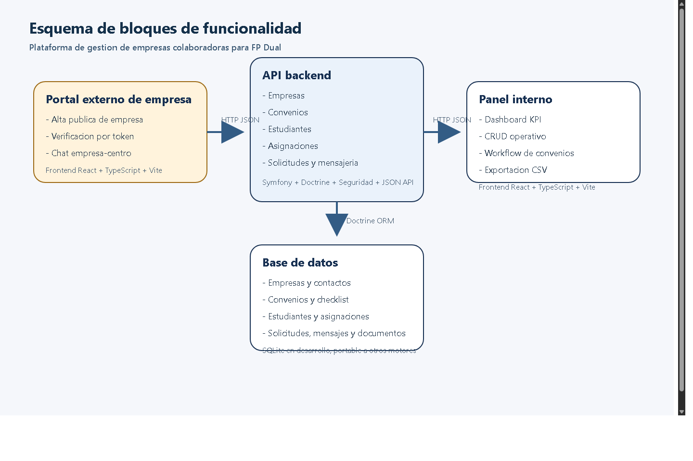
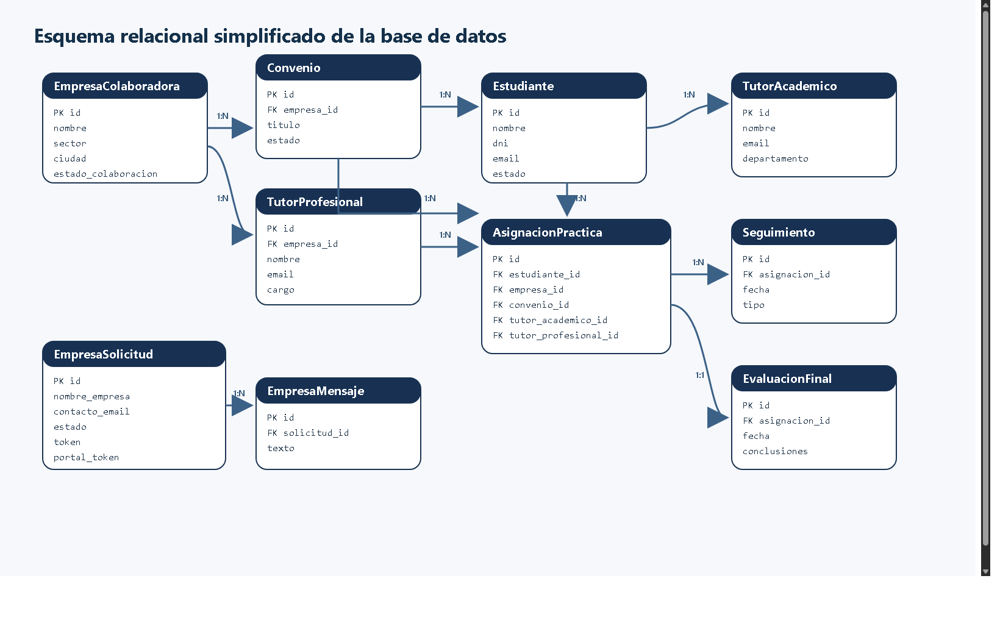
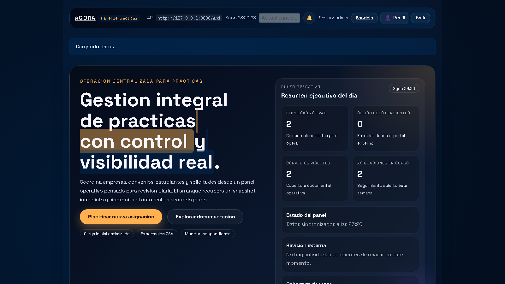
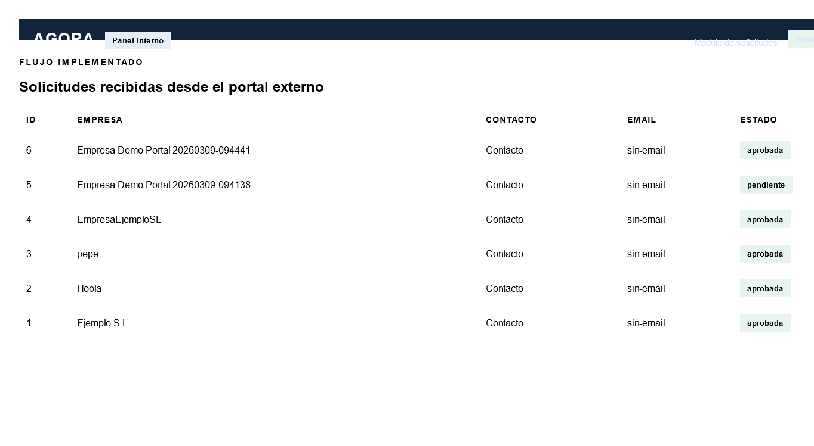
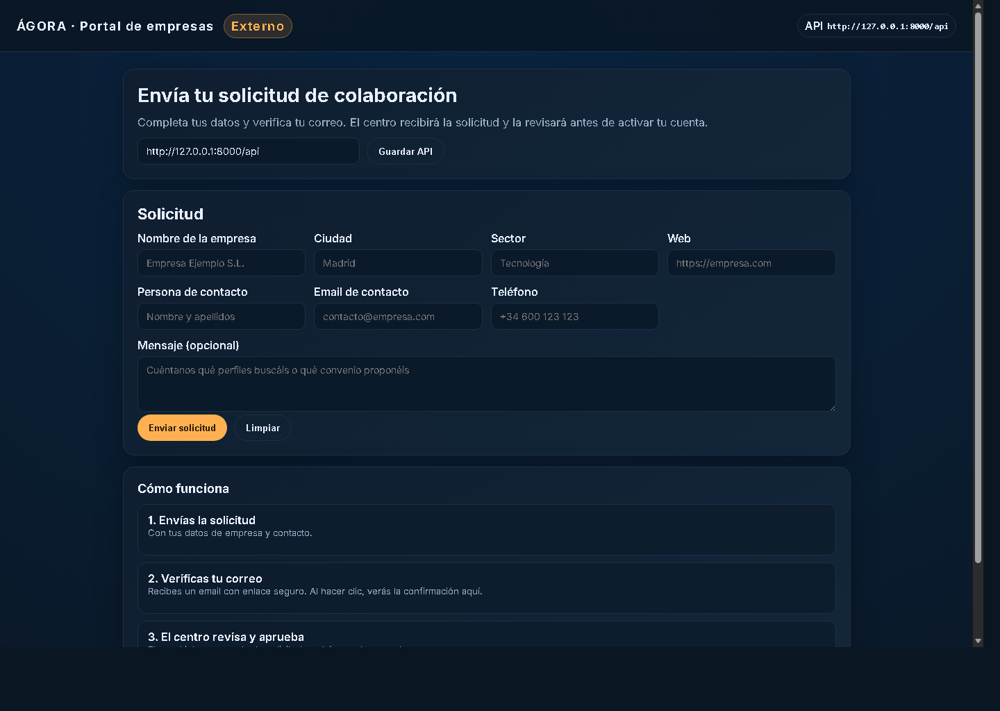
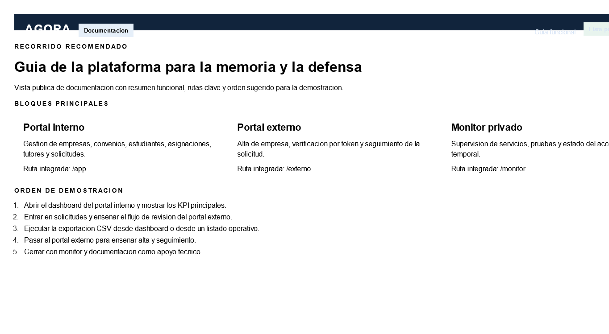
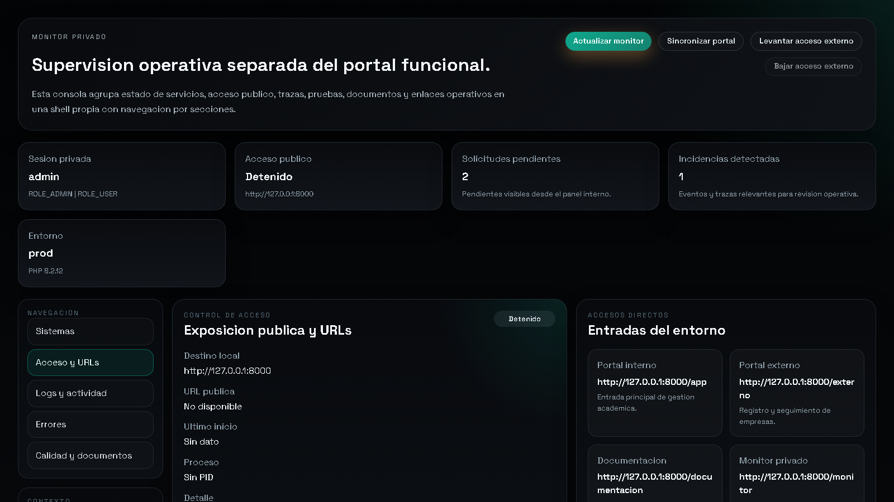

# Agradecimientos

Quiero agradecer a mi tutora Elena el seguimiento continuo del trabajo, la revision critica de la memoria y la orientacion tecnica y academica durante todo el desarrollo. Tambien agradezco al centro educativo y al profesorado el contexto real aportado para orientar el proyecto hacia una necesidad concreta y utilizable. Por ultimo, agradezco a mi entorno personal el apoyo prestado durante las fases de analisis, implementacion, pruebas y cierre documental.

# Resumen

## Resumen (ES)

Este proyecto desarrolla una plataforma web para gestionar empresas colaboradoras, convenios, estudiantes, tutores y solicitudes externas en un entorno de FP Dual. La solucion se compone de una API en Symfony, un portal interno en React y TypeScript, un portal externo orientado a empresas interesadas en colaborar con el centro y dos espacios complementarios separados: documentacion y monitor privado. La aplicacion centraliza el ciclo operativo completo: alta de empresas, verificacion por correo, seguimiento de solicitudes, gestion de convenios, asignacion de estudiantes, supervision documental y exportacion CSV de datos operativos. La entrega final prioriza una arquitectura mantenible, separacion clara de responsabilidades y un entorno de uso demostrable con build integrada bajo una unica URL local.

Palabras clave: FP Dual, empresas colaboradoras, convenios, Symfony, React, gestion academica.

## Summary (EN)

This project delivers a web platform to manage partner companies, agreements, students, mentors, and external registration requests for dual training. The solution combines a Symfony API, an internal React and TypeScript portal, an external company portal, and two separated support spaces for documentation and private monitoring. The platform centralizes the full operational workflow: company registration, email verification, request tracking, agreement management, student assignment, document supervision, and CSV export of operational records. The final delivery prioritizes maintainable architecture, clear separation of responsibilities, and a demonstrable integrated build under a single local URL.

Keywords: dual training, partner companies, agreements, Symfony, React, academic management.

# Introduccion y contexto

La gestion de empresas colaboradoras y practicas formativas se apoyaba inicialmente en hojas de calculo, correos electronicos y documentos repartidos entre distintas carpetas. Ese enfoque provocaba duplicidades, falta de trazabilidad, escasa visibilidad sobre el estado real de las solicitudes y una dependencia excesiva del seguimiento manual. El proyecto parte de esa necesidad y reorganiza el antiguo contexto tecnico de Agora para reorientarlo hacia un problema concreto del centro educativo: controlar el alta de empresas, formalizar convenios y gestionar asignaciones de estudiantes desde una unica plataforma.

El resultado no pretende ser un prototipo aislado, sino una base operativa y ampliable. Por eso la aplicacion separa el acceso interno, el acceso externo y la API, y documenta tanto la arquitectura como la validacion tecnica necesaria para su defensa academica y evolucion futura.

# Objetivos y alcance

## Objetivo general

Disenar e implantar una aplicacion web que centralice la gestion de empresas colaboradoras y practicas formativas, unificando informacion operativa, control documental y seguimiento de estados en una unica plataforma.

## Objetivos especificos

1. Digitalizar el ciclo de vida de empresa, convenio, estudiante, tutor y asignacion.
2. Habilitar un flujo publico de solicitud de empresa con validacion y aprobacion interna.
3. Ofrecer un panel interno con indicadores, tablas operativas, detalle de entidades y acciones CRUD.
4. Incorporar soporte documental, checklist y alertas dentro del workflow de convenios.
5. Permitir la exportacion CSV de la informacion operativa relevante.
6. Mantener una arquitectura separada y mantenible entre API, portal interno y portal externo.

## Alcance

Dentro del alcance actual se incluyen el portal interno, el portal externo, la API REST, la persistencia relacional, la autenticacion del panel, la gestion de solicitudes externas, la verificacion por correo, el seguimiento de estado, la mensajeria asociada, el control documental, la exportacion CSV y un monitor privado separado para operacion tecnica. Quedan fuera de alcance, en esta entrega, la firma electronica avanzada, las integraciones con sistemas corporativos, un area postaprobacion completa para empresas consolidadas con cuentas persistentes, el almacenamiento documental en nube y una bateria E2E completa de navegador.

# Analisis de requisitos

## Problema a resolver

El centro necesita una herramienta que reduzca la fragmentacion de informacion, acelere la validacion de nuevas empresas y permita consultar en tiempo real el estado de convenios, estudiantes, asignaciones y solicitudes. El problema no es solo almacenar datos, sino garantizar continuidad operativa, trazabilidad y capacidad de supervision.

## Actores principales

- Coordinacion o administracion interna.
- Tutores academicos.
- Tutores profesionales.
- Estudiantes vinculados a practicas.
- Empresas interesadas en colaborar con el centro.

## Requisitos funcionales

- Consultar indicadores y tablas de gestion desde el panel interno.
- Crear, editar y revisar empresas, convenios, estudiantes y asignaciones.
- Registrar solicitudes externas de empresa y revisarlas desde el panel interno.
- Asociar mensajes y evidencia documental a solicitudes y entidades operativas.
- Exportar informacion en CSV desde dashboard y modulos principales.
- Supervisar estado tecnico y operativo desde un monitor privado separado.

## Requisitos no funcionales

- Interfaz responsive y diferenciada por contexto de uso.
- Seguridad basada en autenticacion y control de acceso.
- Arquitectura mantenible, con separacion clara entre backend y frontends.
- Persistencia portable en desarrollo y despliegue reproducible.
- Rendimiento suficiente para navegacion fluida y carga razonable en entorno local.

# Diseno de la solucion

## Arquitectura general

La solucion se estructura en cuatro bloques principales. La primera es una API REST construida con Symfony, responsable de la seguridad, la logica de negocio, la persistencia y la exposicion de endpoints. La segunda es un portal interno desarrollado con React, TypeScript y Vite, orientado a coordinacion academica y gestion operativa. La tercera es un portal externo, tambien basado en React y TypeScript, que permite registrar nuevas empresas, verificar el correo de contacto, consultar el estado de la solicitud y mantener una mensajeria asociada. La cuarta se divide en dos shells complementarias: una pagina documental para memoria y anexos, y un monitor privado para supervision tecnica.

El backend publica rutas protegidas bajo `/api` y rutas publicas para el registro externo, la confirmacion por correo y el acceso por token al portal de solicitud. En la entrega integrada, el panel interno se sirve bajo `/app`, la documentacion bajo `/documentacion`, el monitor privado bajo `/monitor` y el portal externo bajo `/externo`.

## Justificacion tecnica de versiones y separacion

El portal interno y el portal externo se desarrollan como SPA independientes. Esta separacion permite evolucionar cada interfaz segun su contexto sin mezclar dependencias ni ciclos de despliegue. El backend se mantiene como pieza central de negocio, y los dos frontends consumen la API con responsabilidades distintas. Esta decision mejora mantenibilidad, claridad de despliegue y aislamiento funcional.

## Modelo de datos

El dominio se organiza en torno a entidades nucleares como `EmpresaColaboradora`, `Convenio`, `Estudiante`, `TutorAcademico`, `TutorProfesional` y `AsignacionPractica`. Sobre ese nucleo se apoyan entidades de soporte como `EmpresaSolicitud`, `EmpresaMensaje`, `EmpresaDocumento`, `ConvenioDocumento`, `ConvenioChecklistItem` y `ConvenioAlerta`. Esta estructura permite cubrir tanto la operacion principal como las necesidades de trazabilidad y documentacion.

## Seguridad y control de acceso

La seguridad del entorno interno se apoya en autenticacion y roles. El panel interno reutiliza credenciales definidas en variables de entorno para las llamadas al backend, mientras que las rutas publicas quedan limitadas al registro externo y a la validacion de enlaces asociados a solicitudes. El sistema diferencia claramente los espacios publico y privado, y deja como mejora futura la incorporacion de mecanismos mas avanzados como MFA, SSO o auditoria ampliada.

## Diseno de interfaz

El portal interno se estructura por modulos: dashboard, empresas, convenios, estudiantes, asignaciones, tutores, solicitudes, documentacion y monitor privado. La interfaz combina tablas, tarjetas de resumen, vistas de detalle, formularios modales y exportaciones CSV desde varios puntos del sistema. El portal externo se organiza en varias rutas coordinadas: registro, correo, estado de solicitud, verificacion, mensajeria y recursos. La documentacion y el monitor se separan del flujo principal para no mezclar uso funcional con supervision tecnica, y el monitor privado se ordena en secciones de sistemas, acceso, logs, errores y calidad documental.

# Implementacion

## Backend Symfony

El backend concentra controladores REST para empresas, convenios, estudiantes, asignaciones y tutores, asi como rutas especificas para solicitudes externas, mensajeria asociada, exportacion CSV y supervision operativa. La persistencia se resuelve con Doctrine ORM y SQLite en desarrollo, con una configuracion facilmente adaptable a otros motores compatibles con Symfony.

## Portal interno

El portal interno funciona como shell de gestion academica y administrativa. Desde ahi se consultan KPI, se gestionan entidades principales, se revisan solicitudes, se accede al detalle de empresas y convenios y se lanzan exportaciones CSV. La aplicacion mantiene un cliente API ligero y una organizacion modular suficiente para separar dashboard, formularios y vistas de detalle.

## Portal externo

El portal externo ofrece una entrada clara para empresas interesadas en colaborar. Incluye formulario de alta, pagina de correo, confirmacion por enlace, seguimiento del estado de la solicitud, mensajeria ligada al token del portal y una pagina de recursos de apoyo. El flujo queda conectado de extremo a extremo con la API: registro publico, emision del correo de verificacion, consulta del estado por token y conversacion asociada con el centro. Su diseno es deliberadamente mas simple que el portal interno para reducir friccion en el primer contacto con la plataforma sin perder trazabilidad.

## Exportacion CSV como ejemplo funcional

La exportacion CSV se implementa como funcionalidad transversal. El dashboard puede generar un resumen CSV desde frontend, mientras que los modulos principales consumen endpoints CSV especificos del backend para descargar listados de empresas, convenios, estudiantes, asignaciones, tutores y solicitudes. Este mecanismo aporta una salida operativa inmediata para trazabilidad, revision documental y defensa funcional del proyecto.

# Despliegue y operacion

## Requisitos del entorno

Para ejecutar el proyecto en local son necesarios PHP, Composer, Node.js, npm y los ficheros `.env.local` correspondientes al backend y a los dos frontends. El backend utiliza SQLite en desarrollo, por lo que no requiere un servidor de base de datos adicional para la demostracion basica.

## Configuracion

La configuracion se apoya en variables de entorno para la URL base, las credenciales del panel interno, el entorno Symfony y las opciones de desarrollo. Esta aproximacion evita credenciales embebidas y permite reproducir el entorno con mayor control.

## Publicacion integrada

La entrega se prepara en modo integrado bajo una unica URL local: `/app` para el portal interno, `/externo` para el portal externo, `/documentacion` para la guia funcional y `/monitor` para la supervision tecnica. Esta organizacion simplifica la demostracion y evita depender de multiples servidores visibles durante la defensa.

# Pruebas y validacion

## Validaciones ejecutadas

La validacion del proyecto combina compilacion de frontends, pruebas automatizadas disponibles, comprobaciones HTTP sobre las rutas integradas y revisiones funcionales de navegacion, documentacion, monitorizacion y exportacion CSV. El backend dispone de pruebas orientadas a autenticacion y controladores clave, mientras que el frontend incorpora pruebas de utilidades y servicios.

## Resultados observados

La build integrada de los dos frontends se genera correctamente y se publica en las rutas del backend. El panel interno, el portal externo, la documentacion y el monitor privado quedan accesibles desde la URL local integrada. La exportacion CSV puede mostrarse como ejemplo funcional completo durante la defensa, y el arranque del panel interno mejora mediante un snapshot cacheado de bootstrap con invalidacion tras cambios de empresas, estudiantes, convenios y asignaciones.

## Rendimiento operativo

Durante la fase final se ha optimizado el endpoint `/api/bootstrap`, que era el principal cuello de botella percibido al cargar el portal interno. La solucion aplicada cachea un snapshot del panel y lo invalida cuando cambian las entidades que alimentan dashboard y listados principales. En mediciones locales, el tiempo de respuesta en frio se redujo desde varios segundos hasta un entorno cercano al segundo largo, mientras que la carga HTML de `/app` se mantiene claramente por debajo del segundo en caliente. Esta mejora no sustituye a una estrategia completa de cache y perfilado en produccion real, pero si deja la navegacion de defensa en un estado considerablemente mas fluido.

## Limitaciones de prueba

Aunque la base tecnica esta validada, no existe todavia una suite E2E completa de navegador. Tampoco se ha implantado una estrategia de carga automatizada o perfilado avanzado en entorno de produccion real. Estas limitaciones no impiden la defensa del proyecto, pero marcan lineas claras de mejora para una iteracion posterior.

# Resultados, limitaciones y lineas futuras

## Resultados principales

El proyecto cumple el objetivo principal de centralizar la gestion de empresas colaboradoras y practicas en una sola plataforma, diferenciando correctamente el espacio interno, el espacio externo, la documentacion y la supervision tecnica. Ademas, deja preparado un flujo demostrable y comprensible para la tutora: registro externo, verificacion por correo, seguimiento de solicitud, revision interna, gestion de entidades y exportacion de datos.

## Limitaciones actuales

- La autenticacion interna es suficiente para el entorno academico de la entrega, pero no cubre escenarios avanzados de identidad corporativa.
- El portal externo todavia no incorpora un area completa de postaprobacion para empresas ya validadas.
- El almacenamiento documental sigue siendo local y debe endurecerse para un uso con datos reales.
- No existe una bateria E2E completa para validar todos los flujos desde navegador.

## Mejoras futuras

Las siguientes iteraciones deberian priorizar, por este orden, el refuerzo de seguridad, la ampliacion del ciclo de vida de empresas y tutores, la gestion avanzada de seguimientos y evaluaciones, el endurecimiento documental, la instrumentacion de rendimiento y la automatizacion E2E del sistema completo.

# Conclusiones

La aplicacion desarrollada aporta una respuesta coherente a un problema real de gestion academica y administrativa. La separacion entre backend, portal interno, portal externo, documentacion y monitor tecnico mejora claridad, mantenibilidad y capacidad de evolucion. Desde el punto de vista academico, el proyecto demuestra no solo implementacion funcional, sino tambien una preocupacion real por arquitectura, validacion, despliegue y presentacion final del producto.

# Referencias

1. Proyecto TFG Agora. `docs/domain-model.md`.
2. Symfony. *Symfony Documentation*.
3. Doctrine Project. *Doctrine ORM Documentation*.
4. React Team. *React Documentation*.
5. Vite Team. *Vite Documentation*.
6. Reglamento (UE) 2016/679 del Parlamento Europeo y del Consejo.

# Anexos

## Anexo A. Manual de usuario

Referencia principal: `docs/anexo-a-manual-usuario.md`.

## Anexo B. Manual tecnico

Referencia principal: `docs/anexo-b-manual-tecnico.md`.

## Anexo C. Capturas y evidencias

Referencia principal: `docs/anexo-c-capturas-y-evidencias.md`.

## Anexo D. Codigo relevante y artefactos de apoyo

Referencias principales:

- `docs/anexo-d-codigo-relevante.md`
- `docs/domain-model.md`
- `docs/refactor-plan.md`
