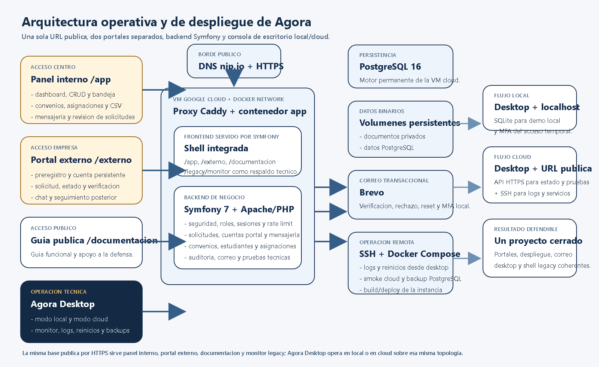
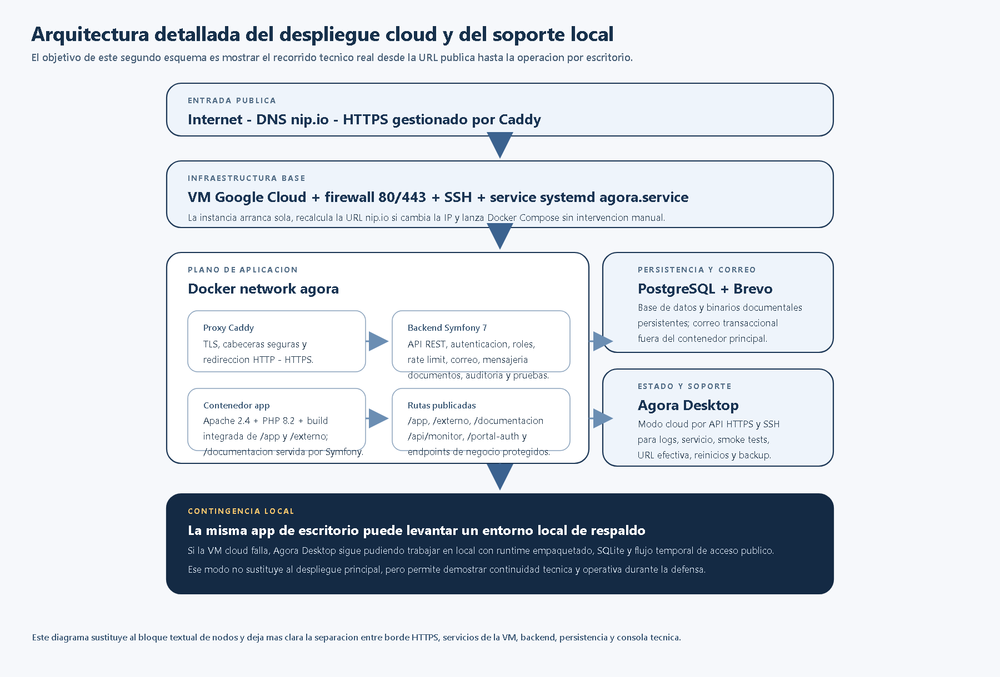
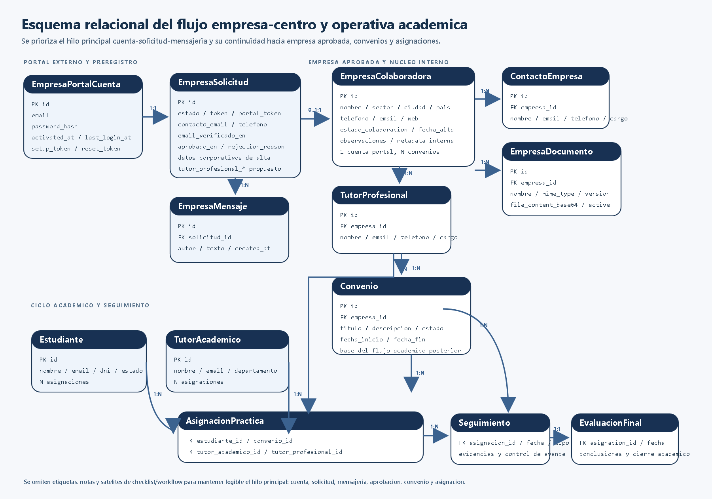
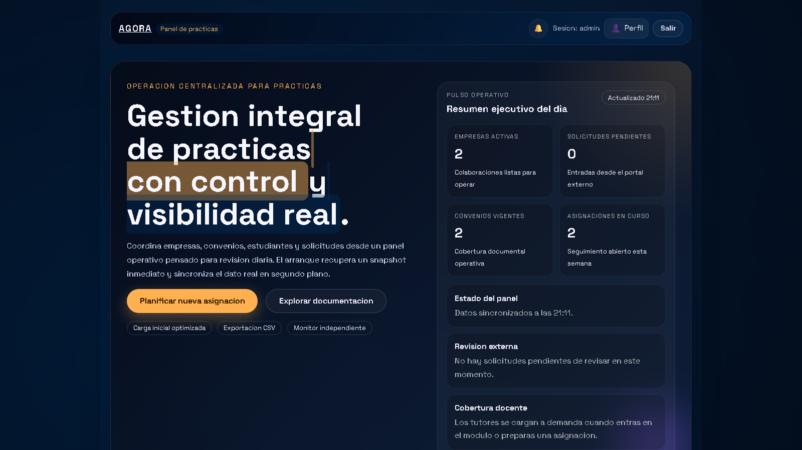
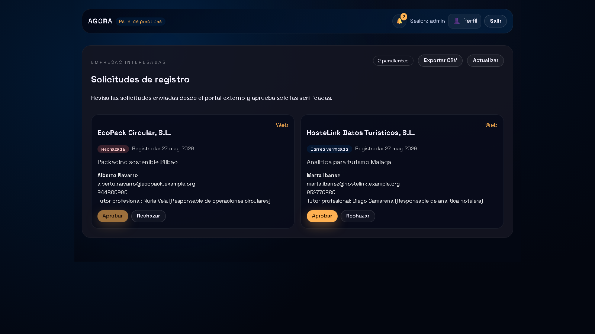
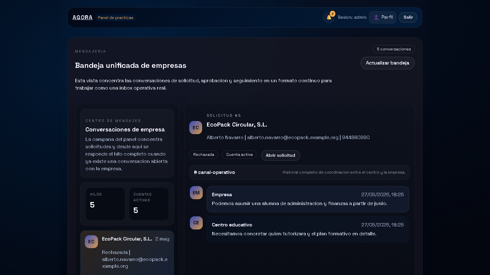
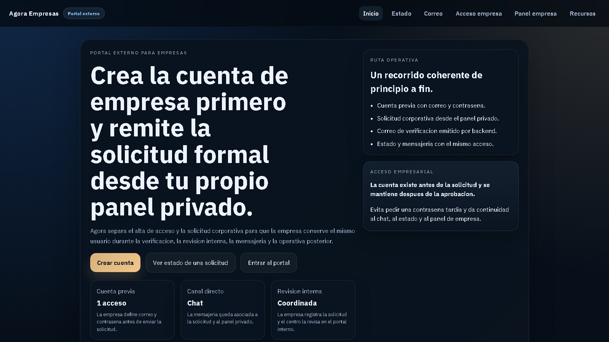
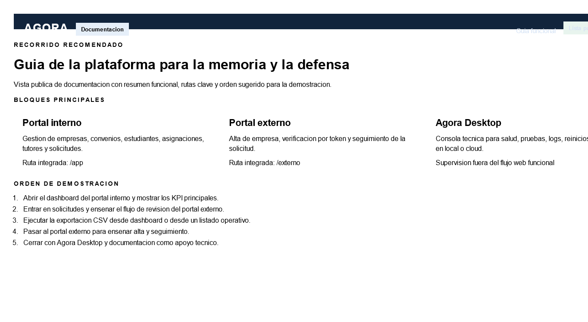
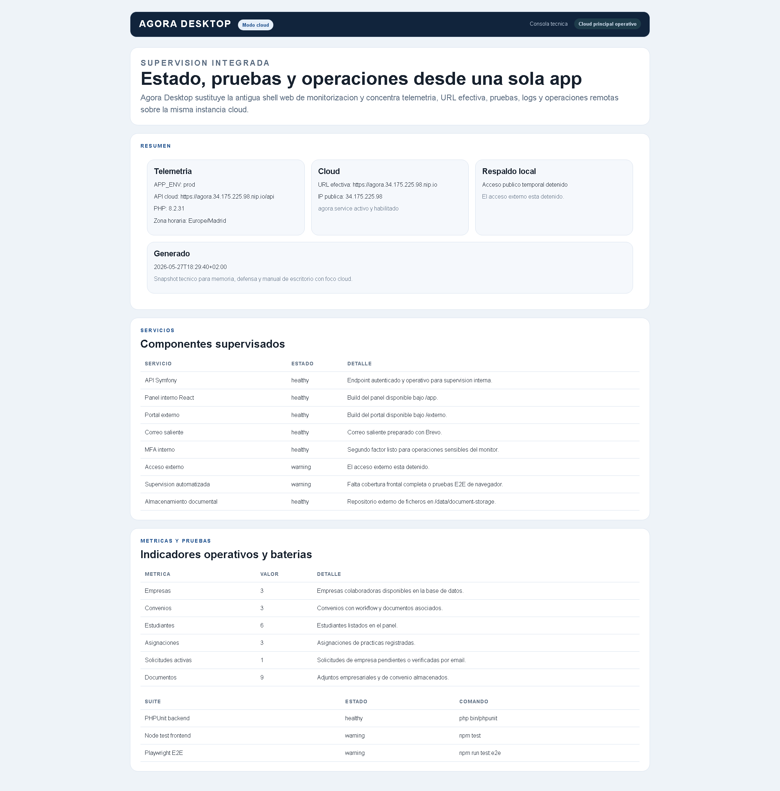

---
title: Gestion de Empresas Colaboradoras para FP Dual
author: Luis Angel
tutor: Elena
reviewDate: 27/05/2026
repository: https://github.com/lmendez861/TFG-Agora
---

# Agradecimientos

Quiero agradecer a mi tutora Elena el seguimiento continuo del trabajo, la revision critica de la memoria y la orientacion academica y tecnica durante todo el desarrollo. Tambien agradezco al centro educativo el contexto real aportado para orientar el proyecto hacia una necesidad concreta y utilizable. Por ultimo, agradezco a mi entorno personal el apoyo prestado durante las fases de analisis, implementacion, pruebas y cierre documental.

# Resumen

## Resumen (ES)

Este proyecto desarrolla una plataforma para gestionar empresas colaboradoras, convenios, estudiantes, tutores y practicas en FP Dual. La solucion integra una API en Symfony, un portal interno, un portal externo, una guia documental y Agora Desktop como consola tecnica local o cloud. El sistema cubre preregistro de empresas, verificacion por correo, aprobacion interna, mensajeria, control documental, asignacion de estudiantes, seguimiento y evaluacion final, con despliegue cloud reproducible y soporte tecnico desacoplado del flujo funcional.

Palabras clave: FP Dual, empresas colaboradoras, convenios, seguimiento, Symfony, React, gestion academica.

## Summary (EN)

This project delivers a platform to manage partner companies, agreements, students, mentors, and internships for dual training. The solution combines a Symfony API, an internal portal, an external company portal, a separate documentation guide, and a desktop technical console for local or cloud operations. It covers company pre-registration, email verification, internal approval, messaging, document control, student assignment, follow-up, and final evaluation, with reproducible cloud deployment and a technical support layer separated from the functional workflow.

Keywords: dual training, partner companies, agreements, follow-up, Symfony, React, academic management.

# Introduccion y contexto

La gestion de empresas colaboradoras y practicas formativas suele apoyarse en hojas de calculo, correos electronicos y documentos repartidos entre distintas carpetas. Ese enfoque genera duplicidades, dificulta la trazabilidad y complica la supervision del estado real de cada solicitud, convenio o asignacion. El proyecto parte de esa necesidad y reorganiza el antiguo contexto tecnico de Agora para resolver un problema concreto del centro educativo: controlar el alta de empresas, formalizar convenios y gestionar practicas desde una unica plataforma coherente.

El resultado ya no se plantea como un prototipo aislado. La aplicacion separa claramente el acceso interno, el acceso externo, la documentacion y la operacion tecnica de escritorio, y refuerza su base con autenticacion, control documental, seguimiento operativo, automatizacion de pruebas y verificacion tecnica. Esta aproximacion permite explicar el sistema de forma comprensible durante la defensa y, al mismo tiempo, dejar una estructura realista para evolucion posterior.

# Objetivos y alcance

## Objetivo general

Disenar e implantar una aplicacion web que centralice la gestion de empresas colaboradoras y practicas formativas, unificando informacion operativa, control documental, comunicacion y seguimiento de estados en una unica plataforma.

## Objetivos especificos

1. Digitalizar el ciclo de vida de empresa, convenio, estudiante, tutor y asignacion.
2. Habilitar un flujo publico de solicitud de empresa con verificacion por correo y revision interna.
3. Proporcionar un panel interno con dashboard, CRUD operativo, bandeja unificada e indicadores de estado.
4. Incorporar un portal de empresa con cuenta persistente previa a la solicitud, acceso continuo, verificacion y recuperacion de contrasena.
5. Gestionar seguimientos, evidencias y evaluacion final dentro de la ficha de asignacion.
6. Implantar control documental con versionado, retirada controlada y restauracion.
7. Permitir la exportacion CSV de la informacion operativa relevante.
8. Mantener una arquitectura separada y mantenible entre API, portal interno, portal externo, documentacion y app de escritorio operativa.

## Alcance

Dentro del alcance actual se incluyen el portal interno, el portal externo, la API REST, la persistencia relacional, la autenticacion interna, el preregistro externo de cuentas de empresa, la verificacion por correo, la aprobacion interna, la mensajeria empresa-centro, la bandeja unificada, el seguimiento con evidencias, la evaluacion final, el control documental versionado, la exportacion CSV, una app de escritorio para operacion tecnica en local o en cloud, y un despliegue funcional en Google Cloud Compute Engine con Docker Compose, PostgreSQL, proxy HTTPS y correo transaccional operativo. El flujo local con MFA para acceso publico temporal sigue existiendo dentro de Agora Desktop, pero ya no hay una pagina web de monitorizacion separada en el recorrido funcional. Quedan fuera de alcance, en esta entrega, la firma electronica avanzada, las integraciones corporativas con ERP o directorios institucionales, el almacenamiento documental en nube gestionada, un cliente de escritorio completo para toda la operativa funcional del negocio y una instrumentacion avanzada de produccion con alta disponibilidad.

# Definiciones

- **Empresa colaboradora**: entidad externa aprobada por el centro para participar en practicas o colaboraciones formativas.
- **Tutor academico**: docente del centro responsable del seguimiento institucional de una asignacion.
- **Tutor profesional**: persona de referencia dentro de la empresa que acompana al estudiante durante la practica.
- **Convenio**: acuerdo formal entre el centro y la empresa que habilita el marco de colaboracion.
- **Asignacion practica**: relacion operativa entre estudiante, convenio y tutores para una practica concreta.
- **Seguimiento**: registro periodico del avance, incidencias y evidencias de una asignacion.

# Notaciones y siglas

- **API**: Application Programming Interface.
- **SPA**: Single Page Application.
- **ORM**: Object Relational Mapper.
- **MFA**: Multi-Factor Authentication.
- **CSV**: Comma-Separated Values.
- **VM**: Virtual Machine.
- **SSH**: Secure Shell.
- **HTTPS**: Hypertext Transfer Protocol Secure.

# Analisis de requisitos

## Problema a resolver

El centro necesita una herramienta que reduzca la fragmentacion de informacion, acelere la validacion de nuevas empresas y permita consultar en tiempo real el estado de convenios, estudiantes, asignaciones, seguimientos, documentos y solicitudes externas. El problema no es solo almacenar datos, sino garantizar continuidad operativa, trazabilidad, control de cambios y capacidad de supervision.

## Actores principales

- Administracion y coordinacion interna.
- Tutores academicos.
- Tutores profesionales.
- Estudiantes vinculados a practicas.
- Empresas interesadas en colaborar con el centro.
- Empresas con cuenta persistente en el portal externo antes y despues de la aprobacion.

## Requisitos funcionales

- Consultar indicadores y modulos de gestion desde el panel interno.
- Crear, editar y revisar empresas, convenios, estudiantes y asignaciones.
- Registrar solicitudes externas de empresa y aprobarlas o rechazarlas desde el panel interno.
- Verificar el correo de contacto de la empresa y mantener una cuenta persistente desde el preregistro hasta la operativa posterior.
- Consultar y responder mensajes desde una bandeja unificada de conversaciones.
- Registrar seguimientos, adjuntar evidencias, cerrar hitos y emitir una evaluacion final.
- Gestionar documentos con versionado, retirada controlada y restauracion.
- Exportar informacion en CSV desde dashboard y modulos principales.
- Supervisar estado tecnico, logs, documentos y acceso publico temporal desde Agora Desktop.

## Requisitos no funcionales

- Interfaz responsive y diferenciada por contexto de uso.
- Seguridad basada en autenticacion, roles y segundo factor para operaciones sensibles.
- Arquitectura mantenible, con separacion clara entre backend y frontends.
- Persistencia portable en desarrollo y despliegue reproducible.
- Rendimiento suficiente para navegacion fluida y carga razonable en entorno local.

# Diseno de la solucion

## Arquitectura general

La solucion se estructura en cinco bloques principales. El primero es una API REST construida con Symfony, responsable de seguridad, logica de negocio, persistencia, auditoria y exposicion de endpoints. El segundo es un portal interno desarrollado con React, TypeScript y Vite, orientado a coordinacion academica y gestion operativa. El tercero es un portal externo, tambien basado en React y TypeScript, que cubre tanto el preregistro inicial como el area posterior de empresa aprobada. El cuarto es una guia documental publica separada del uso operativo. El quinto es Agora Desktop, una app Electron para operacion tecnica local o remota, automatizacion de pruebas, diagnostico, logs, reinicios y empaquetado Windows.

El backend publica rutas protegidas bajo `/api`, rutas publicas acotadas para preregistro y verificacion externa, rutas de autenticacion para cuentas de empresa y una shell integrada para servir los dos frontends. En la entrega integrada, el panel interno se sirve bajo `/app`, la documentacion bajo `/documentacion` y el portal externo bajo `/externo`. La app de escritorio trabaja sobre la misma raiz publica, consume `/api/monitor` y complementa esa telemetria con operaciones remotas por SSH sobre la VM. No replica la logica funcional del portal interno: se limita deliberadamente a la supervision tecnica, la ejecucion de pruebas, la lectura de logs, la deteccion de la URL cloud efectiva y ciertas operaciones de infraestructura local o remota, como el control de `agora.service`.



## Arquitectura tecnologica

Si se expresa la solucion en capas tecnologicas, la arquitectura puede resumirse asi:

1. **Capa de presentacion interna**: SPA en React y TypeScript servida bajo `/app`, destinada a coordinacion y gestion academica.
2. **Capa de presentacion externa**: SPA independiente en React y TypeScript servida bajo `/externo`, destinada a empresas colaboradoras antes y despues de su aprobacion.
3. **Capa de negocio**: backend Symfony 7 que centraliza autenticacion, roles, validacion, reglas de negocio, auditoria, MFA y exposicion de API REST.
4. **Capa de persistencia**: Doctrine ORM sobre SQLite en desarrollo y sobre un motor de servidor como PostgreSQL o MariaDB en despliegue permanente.
5. **Capa documental y operativa**: documentacion publica y app de escritorio para soporte tecnico, pruebas y empaquetado.
6. **Capa de infraestructura**: VM publica en Google Cloud Compute Engine o entorno local empaquetado, contenedores Docker, proxy HTTPS, almacenamiento persistente para documentos, servicio de correo transaccional y resolucion publica por DNS wildcard.

Esta explicacion es especialmente util para la defensa, porque permite exponer la aplicacion mediante esquemas y responsabilidades en lugar de entrar en codigo fuente. Tambien deja claro que el sistema ya no depende conceptualmente de una unica maquina local, sino de componentes desacoplados que pueden redistribuirse en un servidor o cloud. La Figura 1 resume precisamente esa topologia final: dos clientes web, una consola tecnica, un borde HTTPS y un backend contenedorizado sobre infraestructura persistente.

### Tecnologias utilizadas y justificacion

De cara a la defensa conviene justificar no solo que tecnologias se han usado, sino por que encajan con el problema real y con el tiempo disponible de la entrega:

- **Symfony 7 + PHP 8.2** en el backend porque ofrecen una base madura para seguridad, validacion, controladores REST, Doctrine, sesiones y correo sin tener que reinventar infraestructura transversal.
- **Doctrine ORM** porque permite modelar entidades como empresa, solicitud, convenio, asignacion y mensaje con relaciones expresivas, migraciones y repositorios mantenibles.
- **React + TypeScript + Vite** en los dos portales porque separan bien experiencia interna y experiencia externa, agilizan la construccion de formularios y tablas reactivas y reducen errores de integracion gracias al tipado.
- **PostgreSQL 16** en cloud porque da persistencia relacional robusta para un despliegue publico real, mientras que **SQLite** sigue siendo util como respaldo local o para la demo offline desde Agora Desktop.
- **Docker Compose** porque simplifica una publicacion reproducible del backend, la base de datos y el proxy, y facilita recuperar el entorno tras reinicios de la VM.
- **Caddy** como proxy HTTPS porque automatiza certificados de Let's Encrypt, cabeceras de seguridad y redireccion HTTP a HTTPS con muy poca configuracion operativa.
- **Brevo** como proveedor de correo porque permite cubrir verificacion, rechazo, recuperacion de cuenta y avisos transaccionales desde un servicio externo especializado.
- **Electron** en Agora Desktop porque resuelve una necesidad distinta del negocio: operar el entorno, leer logs, reiniciar servicios, ejecutar pruebas y disponer de un modo local de contingencia si la VM cloud falla.
- **PHPUnit, Vitest y Playwright** porque cubren tres niveles distintos de validacion: logica de backend, comportamiento unitario del frontend y flujos criticos integrados sobre navegador.

### Esquema detallado de arquitectura

En la defensa resulta mas claro bajar un nivel adicional y mostrar el recorrido tecnico real desde la URL publica hasta la consola de soporte. Por eso, en vez de dejar un arbol textual largo, se incorpora un segundo esquema visual centrado en el despliegue efectivo y en la separacion entre flujo funcional y operacion tecnica.



La lectura correcta de este segundo esquema es la siguiente:

1. La misma URL publica sirve `/app`, `/externo` y `/documentacion`.
2. Caddy termina HTTPS y protege el acceso exterior antes de entregar la peticion al contenedor principal.
3. Symfony concentra la API, la autenticacion, la logica de negocio, la mensajeria, el correo y el control documental.
4. PostgreSQL y los documentos persisten fuera del ciclo de vida del contenedor.
5. Agora Desktop opera por API y SSH sobre la misma instancia cloud, pero mantiene tambien un modo local de respaldo si la VM no esta disponible.

Este esquema deja claro un punto importante para la defensa: el portal externo no es una pagina estatica conectada de forma superficial a la API, sino un cliente autenticado con su propio firewall, su propio proveedor de usuarios y un flujo separado del panel interno, aunque ambos compartan el mismo nucleo de negocio.

Este segundo nivel ayuda a defender que la solucion ya no depende del portatil de desarrollo. La URL publica termina en una VM aislada, el backend y la base de datos quedan encapsulados en contenedores, los documentos persisten fuera del ciclo de vida del contenedor y el correo transaccional sale por un proveedor externo dedicado.

## Justificacion tecnica de la separacion

El portal interno y el portal externo se desarrollan como SPA independientes. Esta separacion permite evolucionar cada interfaz segun su contexto sin mezclar dependencias, ciclos de despliegue ni decisiones de UX. El backend se mantiene como pieza central de negocio y seguridad, mientras que la documentacion se sirve como shell diferenciada y la supervision tecnica se desplaza a Agora Desktop para no contaminar el flujo funcional del producto.

No se trata de dos programas distintos que resuelvan el mismo problema, sino de dos accesos diferenciados a una misma plataforma. El portal interno responde a necesidades de coordinacion, validacion y administracion del centro, mientras que el portal externo responde a la experiencia de empresa antes y despues de su aprobacion. Mantener ambos recorridos en aplicaciones separadas reduce complejidad visual, evita exponer logica interna al usuario externo y permite aplicar reglas de seguridad, navegacion y despliegue diferentes sin duplicar la logica de negocio, que sigue concentrada en la API Symfony.

Esta decision tambien mejora la defensa tecnica del proyecto. Permite explicar con claridad que existe un unico nucleo de datos y procesos, pero varias interfaces especializadas segun el actor que entra al sistema. De este modo, la plataforma resulta mas coherente que una unica SPA con permisos cruzados, menus condicionales y estados de acceso heterogeneos.

## Modelo de datos

El dominio se organiza en torno a entidades nucleares como `EmpresaColaboradora`, `Convenio`, `Estudiante`, `TutorAcademico`, `TutorProfesional` y `AsignacionPractica`. Sobre ese nucleo se apoyan entidades de soporte como `EmpresaSolicitud`, `EmpresaMensaje`, `EmpresaPortalCuenta`, `EmpresaDocumento`, `ConvenioDocumento`, `Seguimiento`, `EvaluacionFinal`, `ConvenioChecklistItem` y `ConvenioAlerta`. Para evitar un esquema ilegible, la figura principal prioriza el hilo que realmente explica el proyecto durante la defensa: cuenta externa, solicitud, mensajeria, aprobacion, convenio y asignacion.



### Relacion detallada entre cuenta, solicitud y mensajeria

La parte que mas conviene explicar con detalle en la memoria y en la defensa es la relacion entre la cuenta de empresa, la solicitud y el canal de mensajes, porque ese eje es el que da continuidad al flujo externo. La Figura 3 ya no se limita al esquema academico basico: incorpora `EmpresaPortalCuenta`, `EmpresaSolicitud`, `EmpresaMensaje`, `EmpresaDocumento`, `ContactoEmpresa` y el puente hacia `Convenio`, `AsignacionPractica`, `Seguimiento` y `EvaluacionFinal`. Los satelites menos explicativos para la defensa, como etiquetas internas o alertas de convenio, quedan descritos en texto pero no cargan visualmente el diagrama principal.

```text
empresa_portal_cuenta
  PK id
  email + password_hash + activated_at + last_login_at
  0..1 empresa_colaboradora asociada tras aprobacion
  0..1 empresa_solicitud asociada mientras existe el proceso de alta

empresa_solicitud
  PK id
  token + portal_token + estado + email_verificado_en + aprobado_en
  datos corporativos y datos de contacto
  1 cuenta portal asociada
  0..n empresa_mensaje

empresa_mensaje
  PK id
  autor + texto + created_at
  1 solicitud
  autor = empresa | centro
  orden cronologico compartido para ambos lados

empresa_colaboradora
  PK id
  1 empresa aprobada en el dominio interno
  1 cuenta portal asociada si el acceso externo sigue activo
  0..n convenio
  0..n empresa_documento
  0..n asignacion_practica
```

Dicho de otra forma, el sistema ya no fuerza un salto brusco entre una “solicitud anonima” y una “cuenta creada despues”. Primero existe la `EmpresaPortalCuenta`, luego la `EmpresaSolicitud` queda ligada a esa cuenta, y finalmente, cuando el centro aprueba, aparece la `EmpresaColaboradora` asociada al mismo acceso. Ese encadenamiento reduce friccion, conserva el historial de mensajes y evita pedir una contrasena tardia solo para poder continuar el proceso.

La relacion de mensajeria merece un matiz adicional. El chat no cuelga de `EmpresaColaboradora`, sino de `EmpresaSolicitud`. Esa decision permite que el canal exista desde la primera revision, siga operativo mientras la empresa esta pendiente o verificada y permanezca visible cuando el centro aprueba y ya existe la ficha interna. En la practica, la empresa escribe siempre con la misma cuenta; lo unico que cambia es el contexto de negocio que el panel muestra alrededor del canal.

## Seguridad y control de acceso

La seguridad del entorno interno se apoya en autenticacion Symfony, jerarquia de roles y una combinacion de `json_login` y sesion de navegador. El sistema diferencia perfiles de administracion, coordinacion, documentacion, monitorizacion y auditoria. En el despliegue cloud, la exposicion publica se sirve tras un proxy HTTPS con certificados de Let's Encrypt, encabezados de seguridad, cookies seguras y limitacion de peticiones. Las operaciones sensibles del flujo local de acceso publico temporal siguen requiriendo MFA por correo. Ademas, las acciones relevantes se registran mediante auditoria interna.

El portal externo dispone de un flujo independiente con su propio firewall y su propio proveedor `EmpresaPortalCuenta`. La cuenta de empresa se crea antes de enviar la solicitud, el login externo queda separado del panel interno y la verificacion por correo se aplica sobre la solicitud corporativa. Esta separacion evita mezclar credenciales, conserva contexto de mensajes y mantiene un unico acceso empresarial antes y despues de la aprobacion.

## Flujo de trabajo operativo

La plataforma no se ha planteado como una suma de CRUD aislados, sino como un flujo de negocio secuencial. El recorrido recomendado comienza en el portal externo con un preregistro de cuenta de empresa. A partir de ese acceso, la empresa completa la solicitud corporativa, valida su correo y espera revision interna. Ese paso no crea automaticamente una operativa academica completa, sino una entrada controlada para que el centro revise la informacion antes de activar la relacion.

Una vez dentro del portal interno, el primer paso correcto es revisar la solicitud o crear manualmente una empresa ya contrastada. Solo cuando la empresa queda en estado activo tiene sentido registrar un convenio. El convenio sigue su propio ciclo de maduracion, desde borrador hasta firmado o vigente. Sobre esa base ya validada se registran estudiantes y tutores, y solo entonces se planifica la asignacion.

Este orden no es solo recomendable desde el punto de vista funcional, sino que tambien se ha reforzado a nivel de aplicacion. En la revision final se ha ajustado el flujo para que la cuenta de empresa exista antes de la solicitud, los convenios se creen solo sobre empresas activas y las asignaciones solo puedan registrarse sobre empresas activas y convenios firmados, vigentes o en renovacion. De este modo se evita introducir practicas sobre datos todavia pendientes de validar y se mantiene una coherencia real entre cuenta, solicitud, empresa, convenio y asignacion.

### Esquema detallado del flujo de trabajo

```text
1. Preregistro de cuenta externa
   Empresa -> /portal-auth/register -> empresa_portal_cuenta

2. Acceso al panel privado de empresa
   Empresa -> /portal-auth/login -> sesion de navegador externa

3. Registro de la solicitud corporativa
   Empresa -> /api/portal-company/request -> empresa_solicitud asociada a empresa_portal_cuenta

4. Verificacion del correo de la solicitud
   Empresa -> enlace /registro-empresa/confirmar?token=...
   Resultado -> empresa_solicitud.estado = email_verificado

5. Revision interna
   Centro -> /app -> /api/empresa-solicitudes, bandeja y mensajes

6. Aprobacion
   Centro -> /api/empresa-solicitudes/{id}/aprobar
   Resultado ->
     - se crea empresa_colaboradora
     - se crea contacto_empresa inicial
     - si la solicitud incluye tutor profesional, se crea su ficha vinculada a la empresa
     - empresa_portal_cuenta se asocia a empresa_colaboradora
     - la cuenta conserva el mismo acceso

7. Operativa posterior
   Empresa -> /api/portal-company/overview, /messages, /documents
   Centro  -> convenios, asignaciones, seguimientos, evaluacion y bandeja
```

Este esquema es el que conviene proyectar durante la defensa cuando se explique que la mensajeria no es un modulo aislado. El chat nace en la solicitud, pero sobrevive al alta de empresa porque la cuenta externa y la solicitud quedan enlazadas desde el principio.

Si se necesita una version todavia mas operativa para exponer el flujo diario, puede resumirse asi:

```text
Estado 1: cuenta creada, sin solicitud
  - la empresa puede iniciar sesion
  - el panel privado muestra formulario de alta

Estado 2: solicitud enviada, correo pendiente
  - la empresa ve el estado de la solicitud
  - el sistema envia verificacion por Brevo

Estado 3: correo verificado, pendiente de revision
  - la empresa ya puede usar el canal de mensajes
  - el centro revisa desde /api/empresa-solicitudes y su bandeja

Estado 4: aprobada
  - se crea empresa_colaboradora
  - la misma cuenta externa pasa a ver convenios, asignaciones y documentos
  - los mensajes anteriores siguen visibles

Estado 5: rechazada
  - la cuenta sigue existiendo
  - el portal muestra motivo de rechazo y trazabilidad del intercambio previo
```

Con esta lectura por estados se entiende mejor por que el refresco automatico de mensajes se resuelve en el portal externo con polling corto sobre `overview`: no se trata de un chat independiente, sino de una vista continua del mismo expediente empresarial a lo largo de todo su ciclo.

## Diseno de interfaz

El portal interno se estructura por modulos: dashboard, empresas, convenios, estudiantes, asignaciones, tutores, solicitudes, bandeja unificada y perfil. La interfaz combina tablas, tarjetas, paneles de detalle, formularios modales, workflows, documentos versionados y exportaciones CSV. El portal externo se organiza en un recorrido coherente entre inicio, registro, correo, estado, acceso empresa, recursos y panel privado. La documentacion y la app de escritorio se mantienen separadas del flujo principal para distinguir claramente uso funcional, supervision tecnica y operacion local.

Dentro del portal interno, los KPI del dashboard no se usan como un recurso estetico, sino como un mecanismo de supervision rapida. Su objetivo es ofrecer al personal del centro una lectura inmediata del estado operativo: volumen de empresas, convenios, estudiantes, asignaciones y actividad pendiente. Esta capa resumida reduce navegacion innecesaria, ayuda a detectar incidencias o cuellos de botella y sirve como punto de entrada a los modulos con mayor carga de gestion. En otras palabras, el dashboard no sustituye a los listados detallados, pero si actua como cuadro de mando para priorizar acciones.













# Implementacion

## Backend Symfony

El backend concentra controladores REST para empresas, convenios, estudiantes, asignaciones, tutores, solicitudes, mensajes, portal de empresa, MFA, acceso publico y monitorizacion. La persistencia se resuelve con Doctrine ORM y SQLite en desarrollo, con configuracion adaptable a otros motores. La logica documental se ha centralizado para validar tipos de archivo, almacenar binarios, versionar documentos activos y permitir restauraciones controladas. En la revision final se ha reforzado el almacenamiento de documentos privados de empresa para que los nuevos binarios queden ligados a la propia entidad y embebidos en base de datos.

## Portal interno

El portal interno funciona como shell de gestion academica y administrativa. Desde ahi se consultan KPI, se gestionan entidades principales, se revisan solicitudes, se accede a fichas 360 de empresas y convenios, se trabaja con seguimientos y se lanzan exportaciones CSV. El panel incorpora una pagina de acceso profesional y una bandeja unificada de mensajeria para conversaciones empresa-centro. En la version final, la sincronizacion del portal funcional es automatica y silenciosa: se refresca de forma periodica y tambien cuando el navegador recupera el foco, sin mostrar la URL tecnica de la API ni un boton manual de sincronizacion durante la demo. Para reforzar la coherencia del proceso, la campana superior concentra tanto las solicitudes pendientes como el acceso a la bandeja, mientras que los formularios filtran y validan las entidades operativas antes de permitir convenios o asignaciones. Ademas, los detalles de convenios, asignaciones, pipeline visual, bandeja y exportaciones CSV se han estabilizado en la revision final tras una pasada de regresion funcional.

## Portal externo

El portal externo ofrece ahora dos momentos de uso enlazados por la misma cuenta. En el primero, una empresa interesada crea un acceso previo con correo y contrasena, entra en su panel privado y desde ahi registra la solicitud corporativa. Despues revisa el correo de verificacion y consulta el estado de la propuesta sin perder el mismo acceso. En el segundo, tras la aprobacion del centro, esa misma cuenta queda asociada a la empresa aprobada y pasa a servir para revisar convenios y asignaciones, descargar documentos y mantener la conversacion con el centro desde un panel privado ya operativo. En la revision final se ha reforzado ademas el comportamiento de mensajeria para que tanto la bandeja interna como el chat del portal externo se refresquen de forma automatica en segundo plano y al recuperar el foco del navegador, mejorando la percepcion de continuidad operativa durante la demostracion.

## Seguimientos y evaluacion final

La ficha de asignacion incorpora ya un modulo real de seguimiento. Desde el panel interno se pueden crear hitos, editar registros, adjuntar evidencias, cerrar seguimientos y reabrirlos si es necesario. Sobre esa misma base se apoya la evaluacion final, que centraliza valoraciones, conclusiones y notas principales del cierre de practicas.

## Control documental y exportacion CSV

El sistema soporta subida de documentos PDF, Word y Excel en empresas, convenios y seguimientos. Cada documento puede registrarse con tipo controlado, descargarse posteriormente y, cuando se sube una nueva version activa, el resto de versiones previas se desactivan para preservar trazabilidad. En paralelo, la exportacion CSV se mantiene como funcionalidad transversal: el dashboard genera un resumen CSV y los modulos principales descargan listados operativos desde endpoints dedicados del backend.

# Despliegue y operacion

## Requisitos del entorno

Para ejecutar el proyecto en local desde el repositorio son necesarios PHP, Composer, Node.js, npm y los ficheros `.env.local` correspondientes. El backend utiliza SQLite en desarrollo, por lo que no requiere un servidor de base de datos separado para la demostracion basica. Los frontends pueden ejecutarse en modo desarrollo con Vite o integrarse en la build final servida por Symfony. Como alternativa, la entrega incorpora ya una app de escritorio empaquetable para Windows que incluye una copia portable de PHP y evita exigir esas dependencias al equipo destino.

## Configuracion

La configuracion se apoya en variables de entorno para base de datos, correo saliente, credenciales del panel, destino MFA, URL base y opciones de desarrollo. Esta aproximacion evita credenciales embebidas y permite reproducir el entorno con mayor control. En la entrega final se ha dejado preparado Brevo como proveedor de correo transaccional para verificacion de empresas, recuperacion de cuentas de empresa, MFA interno y avisos de rechazo de solicitudes externas.

En la practica, la autenticacion interna combina configuracion de frontend y backend. El frontend interno lee desde `import.meta.env` las variables `VITE_API_BASE_URL`, `VITE_API_USERNAME` y `VITE_API_PASSWORD`, que determinan contra que API se conecta y con que credenciales iniciales realiza el acceso. A partir de ahi, el backend Symfony resuelve la autenticacion real mediante `json_login`, genera la sesion del navegador y aplica los permisos correspondientes sobre las rutas protegidas. De forma paralela, el backend utiliza su propio `.env.local` para base de datos, correo saliente, remitente, MFA y resto de configuracion operativa. Esta separacion permite cambiar credenciales o infraestructura sin modificar el codigo fuente.

## Publicacion integrada

La entrega se mantiene integrada bajo una unica raiz: `/app` para el portal interno, `/externo` para el portal externo y `/documentacion` para la guia funcional. En la revision final esa integracion ya no se limita al equipo local: se ha publicado en una VM Ubuntu de Google Cloud Compute Engine con Docker Compose, PostgreSQL, volumen persistente para documentos y un proxy HTTPS delante de la aplicacion. De este modo los dos portales quedan accesibles desde el exterior sin depender del portatil del alumno. En paralelo, Agora Desktop sigue existiendo como alternativa local autocontenida para diagnostico, empaquetado y demostracion offline, y como consola tecnica remota para la VM.

Durante la revision final se ha corregido ademas un aspecto importante de acceso externo: los enlaces de verificacion y recuperacion ya no quedan ligados a `127.0.0.1` ni a una IP local cuando el flujo se prueba desde fuera. Si se define `APP_EXTERNAL_BASE_URL`, el backend genera esas URLs con el origen publico correcto. En el despliegue actual se ha usado un hostname gratuito basado en `nip.io`, con formato `agora.<IP_PUBLICA>.nip.io`, para evitar comprar dominio solo con fines de validacion academica y mantener un nombre estable para la demo. Para evitar dependencia manual tras reinicios, la VM arranca Agora mediante `agora.service` y recalcula la URL efectiva si la IP publica cambia; esa URL queda visible en Agora Desktop junto con el estado del servicio.

## Acceso para evaluacion externa

Para que la profesora pueda probar la aplicacion no es necesario que instale PHP, Composer, Node.js ni npm. La via principal es el despliegue publico en Google Cloud, accesible por HTTPS mediante un hostname `nip.io` derivado de la IP publica. Desde esa misma direccion se accede a los espacios principales de la entrega:

- `URL/app` para el panel interno;
- `URL/externo` para el portal de empresa;
- `URL/documentacion` para la guia funcional;
- Agora Desktop como consola tecnica unica para estado, pruebas, logs, reinicios y backups.

Como alternativa existe la app de escritorio empaquetada en Windows, que incorpora el runtime PHP y automatiza la preparacion del entorno local. En ese caso la persona evaluadora solo tendria que abrir la aplicacion, levantar el entorno y acceder a las rutas locales desde la propia interfaz. Aun asi, para una revision remota real la via recomendada ya no es el tunel temporal, sino la URL publica de la VM.

Para facilitar pruebas externas controladas se han dejado preparados dos usuarios especificos de coordinacion, `profesora` y `profesor`, ambos con contrasena `Abrete01`. Estos accesos permiten revisar panel interno, solicitudes, convenios, asignaciones y bandeja desde la URL publica del despliegue sin reutilizar la cuenta de administrador principal durante la demostracion academica.

## Despliegue permanente previsto

Aunque la entrega sigue siendo academica, la arquitectura ya se ha llevado a un despliegue remoto funcional. La opcion aplicada en esta revision ha sido una VM Linux en Google Cloud Compute Engine con Docker Compose, proxy Caddy con certificados de Let's Encrypt, Apache/PHP en contenedor, PostgreSQL 16 y volumen persistente. Esta base encaja bien con el proyecto porque reutiliza la estructura actual sin reescribir Agora hacia servicios mas opinionados como Cloud Run o Cloud SQL. En este escenario, SQLite deja de ser la base recomendada y pasa a utilizarse solo como soporte de desarrollo o demo local.

Como mejora posterior seguiria siendo recomendable sustituir el hostname wildcard gratuito por un dominio institucional propio, automatizar rotacion de secretos y backups fuera de la propia VM, y mover el almacenamiento documental a un servicio gestionado con politicas de retencion. Estas necesidades no implican rehacer la aplicacion, sino completar la capa de infraestructura y endurecimiento para un uso continuo fuera del entorno academico.

# Pruebas y validacion

## Validaciones ejecutadas

La validacion del proyecto combina compilacion de ambos frontends, pruebas automatizadas de backend, pruebas unitarias del frontend interno, pruebas E2E de flujos criticos con Playwright, comprobaciones HTTP sobre las rutas integradas, smoke tests de Agora Desktop y revisiones funcionales de correo, monitorizacion tecnica, documentacion, mensajeria, exportacion CSV, convenios, asignaciones, tutores, documentos privados de empresa y recuperacion tras reinicio de la VM.

En la ultima pasada completa, realizada el 27/05/2026, se han rehecho ademas comprobaciones especificas que eran sensibles para la defensa: carga de documentos PDF y Excel, descarga autenticada desde el portal interno, descarga autenticada desde el portal externo, refresco automatico de la bandeja y del chat, flujo completo de correo de verificacion y recuperacion tras reinicio de la VM publica con `agora.service`.

## Resultados observados

La build integrada de los dos frontends se genera correctamente y se publica en las rutas del backend. El panel interno, el portal externo y la documentacion quedan accesibles tanto en la URL local integrada como en el despliegue remoto de Google Cloud. El flujo de empresa cubre preregistro de cuenta, solicitud corporativa, verificacion, revision interna, continuidad de acceso y operativa posterior. La revision final ha confirmado tambien la correccion de exportaciones CSV, validacion de contrasenas del portal externo, detalle de convenios, detalle de asignaciones, edicion de tutores, relacion entre tutores profesionales y empresa, contador de tutores en tarjetas, almacenamiento documental privado de empresa, refresco automatico de mensajeria, notificacion de rechazo por correo y operativa de la app de escritorio.

De cara a la entrega, los artefactos de apoyo a la defensa, como el video demostrativo y la muestra CSV/Excel utilizada para explicar la exportacion, se han regenerado con datos anonimizados. Esto permite apoyar la exposicion con evidencias reales del sistema sin exponer direcciones de correo u otros datos personales innecesarios.

## Rendimiento operativo

Durante la fase final se ha optimizado el endpoint `/api/bootstrap`, que era el principal cuello de botella percibido al cargar el portal interno. La solucion aplicada cachea un snapshot del panel y lo invalida cuando cambian las entidades que alimentan dashboard y listados principales. Esta mejora reduce el trabajo inicial del frontend y evita refrescos innecesarios al navegar por modulos operativos.

## Revision comparativa y auditoria final

Antes de cerrar la entrega he revisado soluciones actuales de gestion de practicas, aprendizaje en empresa y portales de empleadores. La comparacion me ha servido para comprobar que el proyecto no se queda en un CRUD basico, sino que cubre una parte importante de lo que ya se espera en este tipo de plataformas: portal externo para empresas, seguimiento de estados, comunicacion centralizada, documentos versionados, evaluaciones, panel de coordinacion, reporting y evidencias para auditoria. En productos como SkillNex se insiste en que el portal de empresa debe reducir la coordinacion por correo, permitir comunicacion con coordinadores y registrar evaluaciones. TrackHelix destaca hojas de horas, aprobacion por empresa, reporting y acuerdos digitales. ImBlaze pone el foco en base de oportunidades, seguimiento del proceso, asistencia, cumplimiento y experiencia del estudiante. Estas referencias confirman que el enfoque del proyecto es actual y que las lineas futuras elegidas son coherentes.

Tambien he realizado una revision final en 20 pasadas tematicas para asegurar que la aplicacion esta preparada para ensenarla:

1. Arquitectura general: backend, panel interno, portal externo, documentacion y Agora Desktop tienen responsabilidades separadas.
2. Seguridad interna: las rutas `/api` quedan protegidas por roles y autenticacion.
3. Seguridad del portal externo: la cuenta de empresa se preregistra, mantiene su sesion separada y conserva el mismo acceso durante solicitud, mensajeria y aprobacion.
4. Contrasenas: el preregistro y la recuperacion de empresa exigen longitud minima, mayusculas, minusculas y numeros.
5. Tokens: los enlaces de verificacion y recuperacion se tratan como valores opacos y se codifican al enviarlos por URL.
6. Documentos: el almacenamiento evita rutas absolutas o con `..` para impedir salir del directorio permitido.
7. Validacion de formularios: backend y frontend validan datos obligatorios antes de persistir.
8. Reglas de negocio: las asignaciones solo se permiten con empresa activa y convenio operativo.
9. Trazabilidad: las acciones relevantes se registran mediante auditoria.
10. Versionado documental: los documentos pueden versionarse, retirarse y restaurarse.
11. Mensajeria: la conversacion empresa-centro queda vinculada a la solicitud y al portal.
12. Evaluacion final: la asignacion permite cerrar el ciclo con valoraciones y conclusiones.
13. Exportacion: el sistema ofrece CSV para justificar reporting operativo.
14. Rendimiento: el snapshot de bootstrap reduce carga inicial del panel.
15. UX interna: el panel concentra dashboard, modulos y bandeja para trabajo diario.
16. UX externa: la empresa tiene un recorrido independiente sin entrar al panel interno.
17. Supervision tecnica: Agora Desktop separa operacion tecnica de gestion funcional.
18. Pruebas backend: PHPUnit cubre controladores, repositorios, seguridad y servicios.
19. Pruebas frontend: los tests unitarios y E2E validan utilidades y flujos reales.
20. Documentacion y defensa: memoria, anexos, guion, presentacion y PDF final quedan alineados.

De esta revision han salido pequenas mejoras aplicadas directamente antes de cerrar la memoria: endurecimiento de rutas de documentos, validacion de contrasenas del portal externo y codificacion de tokens en el envio de mensajes. Otras funciones observadas en plataformas comerciales, como matching automatico estudiante-empresa, hojas de horas con aprobacion tripartita, firma electronica avanzada, acceso movil/offline e integraciones con sistemas externos, quedan justificadas como evolucion futura porque aumentarian mucho el alcance de esta entrega.

## Estado tecnico de validacion

En la revision final se han ejecutado, como minimo, estas comprobaciones:

- `php bin/phpunit` en backend;
- `npm test -- --run` en `frontend/app`;
- `npm run test:e2e` en `frontend/app` para flujos criticos;
- `npm run build:backend` en `frontend/app`;
- `npm run build:backend` en `frontend/company-portal`;
- `npm run check`, `npm run smoke:workflow`, `npm run package:win` y `npm run validate:packaged` en `desktop`;
- comprobaciones HTTP de `/app`, `/externo`, `/documentacion`, `/api/bootstrap`, `/api/monitor` y `/api/empresa-solicitudes/bandeja`.

En la ultima validacion completa, el backend ha quedado en 110 tests y 628 aserciones correctas, el frontend interno en 14 tests unitarios, Playwright en 6 pruebas E2E superadas y Agora Desktop en smoke de flujo, instalador Windows y validacion del runtime empaquetado con PHP embebido, SQLite y rutas integradas respondiendo correctamente.

## Limitaciones actuales

Aunque la base tecnica es ya consistente, el proyecto sigue teniendo limitaciones propias de una entrega academica avanzada y no de un producto desplegado en produccion permanente:

- no existe todavia integracion con identidad corporativa o SSO institucional;
- el almacenamiento documental general sigue apoyandose en volumen local de la VM, aunque los documentos privados de empresa ya puedan embebirse en base de datos;
- la app de escritorio ya cubre supervision tecnica local y remota, pero no absorbe aun toda la operativa funcional del portal interno;
- el rendimiento ha mejorado de forma clara, pero no se ha realizado todavia un perfilado profundo con carga concurrente, observabilidad completa ni estrategia de alta disponibilidad.

# Resultados, limitaciones y lineas futuras

## Resultados principales

El proyecto cumple el objetivo principal de centralizar la gestion de empresas colaboradoras y practicas en una sola plataforma, diferenciando correctamente el espacio interno, el externo, la documentacion, la supervision tecnica y la operacion desde escritorio. Ademas, deja preparado un flujo demostrable y comprensible para la defensa: preregistro externo, verificacion por correo, seguimiento del estado, revision interna, gestion de entidades, control documental, exportacion CSV, despliegue cloud accesible por HTTPS y consola tecnica de soporte en Windows.

### Funcionalidades cerradas en esta entrega

- portal interno operativo bajo `/app` con dashboard, solicitudes, bandeja, convenios, estudiantes, tutores y asignaciones;
- portal externo operativo bajo `/externo` con preregistro de cuenta, login, verificacion, recuperacion, solicitud y estado continuo;
- pagina de documentacion publica integrada bajo `/documentacion` para guiar la demostracion y el uso funcional;
- flujo empresa-centro completo con aprobacion, rechazo, mensajeria y creacion automatica del tutor profesional propuesto al aprobar;
- control documental con versionado, retirada, restauracion, vista previa y descarga autenticada;
- despliegue cloud por HTTPS con VM publica, PostgreSQL, correo real y arranque automatico por `agora.service`;
- Agora Desktop como consola tecnica principal para modo cloud y como respaldo local si la VM falla.

### Mejoras futuras ya identificadas

- dominio institucional propio en lugar de `nip.io`;
- servicios gestionados para documentos, copias y observabilidad;
- SSO institucional y endurecimiento adicional de secretos y despliegue;
- ampliacion de Agora Desktop sin mezclarlo con la operativa funcional diaria del centro.

## Lineas futuras

Las siguientes iteraciones deberian priorizar mejoras secundarias o de evolucion, no bloqueantes para la entrega actual:

1. ampliar Agora Desktop como cliente tecnico principal sin mezclarlo con operativa funcional de negocio;
2. decidir si el escritorio debe seguir siendo solo consola tecnica o si debe incorporar bandeja, aprobaciones y mensajeria del negocio;
3. integrar identidad corporativa o SSO institucional para evitar cuentas aisladas del centro;
4. mover almacenamiento documental y copias de seguridad a servicios gestionados con politicas de retencion;
5. sustituir el hostname `nip.io` por un dominio institucional propio y formalizar la gestion de secretos;
6. ampliar la suite de regresion automatica y el perfilado de rendimiento con carga concurrente;
7. valorar firma electronica avanzada, hojas de horas, matching entre estudiantes y convenios y cuadros de mando por perfil como ampliaciones funcionales posteriores.

# Conclusiones

La aplicacion desarrollada aporta una respuesta coherente a un problema real de gestion academica y administrativa. La separacion entre backend, portal interno, portal externo, documentacion y app de escritorio mejora claridad, mantenibilidad y capacidad de evolucion. Desde el punto de vista academico, el proyecto demuestra no solo implementacion funcional, sino tambien una preocupacion real por arquitectura, validacion, operacion, seguridad, empaquetado y presentacion final del producto.

# Referencias

1. Proyecto TFG Agora. `docs/domain-model.md`.
2. Symfony. *Symfony Documentation*.
3. Doctrine Project. *Doctrine ORM Documentation*.
4. React Team. *React Documentation*.
5. Vite Team. *Vite Documentation*.
6. Reglamento (UE) 2016/679 del Parlamento Europeo y del Consejo.
7. SkillNex. *Employer Portal for Internship Programmes*.
8. TrackHelix. *Work-Based Learning and Timesheets Features*.
9. ImBlaze. *Internship Management System*.

# Anexos

## Anexo A. Manual de usuario

Referencia principal: `docs/anexo-a-manual-usuario.md`.

## Anexo B. Manual tecnico

Referencia principal: `docs/anexo-b-manual-tecnico.md`.

## Anexo C. Capturas y evidencias

Referencia principal: `docs/anexo-c-capturas-y-evidencias.md`.

## Anexo D. Codigo relevante y artefactos de apoyo

Referencias principales:

- `docs/anexo-d-codigo-relevante.md`
- `docs/domain-model.md`
- `docs/refactor-plan.md`

