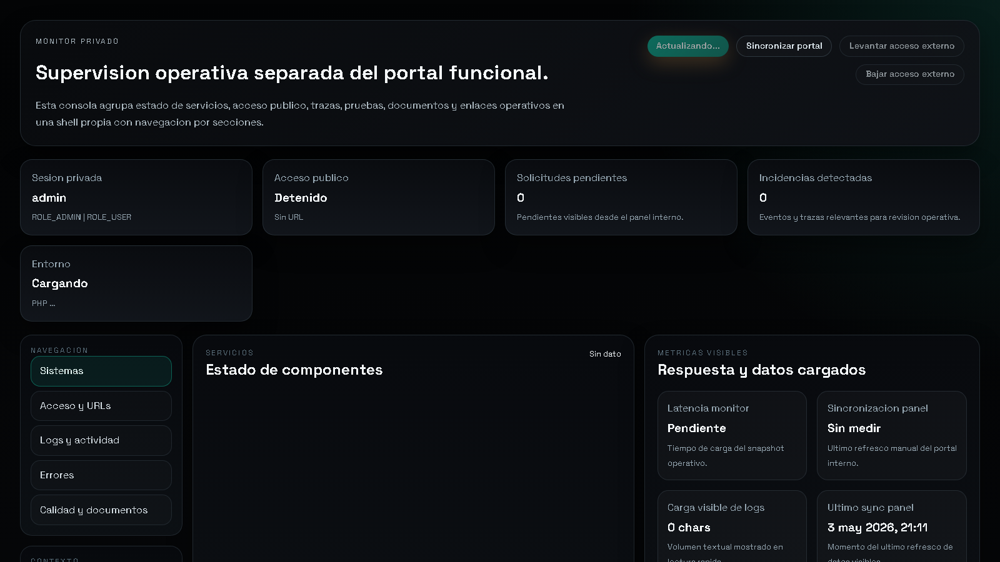

# Agradecimientos

Quiero agradecer a mi tutora Elena el seguimiento continuo del trabajo, la revision critica de la memoria y la orientacion academica y tecnica durante todo el desarrollo. Tambien agradezco al centro educativo el contexto real aportado para orientar el proyecto hacia una necesidad concreta y utilizable. Por ultimo, agradezco a mi entorno personal el apoyo prestado durante las fases de analisis, implementacion, pruebas y cierre documental.

# Resumen

## Resumen (ES)

Este proyecto desarrolla una plataforma para gestionar empresas colaboradoras, convenios, estudiantes, tutores, seguimientos y solicitudes externas en un entorno de FP Dual. La solucion se compone de una API en Symfony, un portal interno en React y TypeScript, un portal externo orientado a empresas interesadas en colaborar con el centro, una guia documental separada, una capa privada de supervision tecnica y una app de escritorio para operacion local. La aplicacion cubre el ciclo operativo completo: alta de empresas, verificacion por correo, revision interna, activacion de cuentas persistentes de empresa, gestion de convenios, asignacion de estudiantes, seguimiento con evidencias, evaluacion final, control documental versionado, exportacion CSV y control local de servicios con pruebas y backups. La entrega final prioriza mantenibilidad, separacion clara de responsabilidades, despliegue integrado y publicacion reproducible tanto en local como en una VM publica, y una base funcional suficientemente solida para su defensa academica.

Palabras clave: FP Dual, empresas colaboradoras, convenios, seguimiento, Symfony, React, gestion academica.

## Summary (EN)

This project delivers a platform to manage partner companies, agreements, students, mentors, follow-up records, and external registration requests for dual training. The solution combines a Symfony API, an internal React and TypeScript portal, an external company portal, a separated documentation guide, a private monitoring layer, and a desktop application for local operations. The platform covers the full operational workflow: company registration, email verification, internal review, persistent company account activation, agreement management, student assignment, follow-up evidence, final evaluation, versioned document control, CSV export, and local service control with testing and backups. The final delivery prioritizes maintainability, clear separation of responsibilities, an integrated single-URL deployment, and a functional baseline suitable for academic defense.

Keywords: dual training, partner companies, agreements, follow-up, Symfony, React, academic management.

# Introduccion y contexto

La gestion de empresas colaboradoras y practicas formativas suele apoyarse en hojas de calculo, correos electronicos y documentos repartidos entre distintas carpetas. Ese enfoque genera duplicidades, dificulta la trazabilidad y complica la supervision del estado real de cada solicitud, convenio o asignacion. El proyecto parte de esa necesidad y reorganiza el antiguo contexto tecnico de Agora para resolver un problema concreto del centro educativo: controlar el alta de empresas, formalizar convenios y gestionar practicas desde una unica plataforma coherente.

El resultado ya no se plantea como un prototipo aislado. La aplicacion separa claramente el acceso interno, el acceso externo, la documentacion, la monitorizacion y la operacion de escritorio, y refuerza su base con autenticacion, control documental, seguimiento operativo, automatizacion de pruebas y verificacion tecnica. Esta aproximacion permite explicar el sistema de forma comprensible durante la defensa y, al mismo tiempo, dejar una estructura realista para evolucion posterior.

# Objetivos y alcance

## Objetivo general

Disenar e implantar una aplicacion web que centralice la gestion de empresas colaboradoras y practicas formativas, unificando informacion operativa, control documental, comunicacion y seguimiento de estados en una unica plataforma.

## Objetivos especificos

1. Digitalizar el ciclo de vida de empresa, convenio, estudiante, tutor y asignacion.
2. Habilitar un flujo publico de solicitud de empresa con verificacion por correo y revision interna.
3. Proporcionar un panel interno con dashboard, CRUD operativo, bandeja unificada e indicadores de estado.
4. Incorporar un portal de empresa postaprobacion con cuenta persistente, acceso y recuperacion de contrasena.
5. Gestionar seguimientos, evidencias y evaluacion final dentro de la ficha de asignacion.
6. Implantar control documental con versionado, retirada controlada y restauracion.
7. Permitir la exportacion CSV de la informacion operativa relevante.
8. Mantener una arquitectura separada y mantenible entre API, portal interno, portal externo, documentacion, monitor privado y app de escritorio operativa.

## Alcance

Dentro del alcance actual se incluyen el portal interno, el portal externo, la API REST, la persistencia relacional, la autenticacion interna, el registro externo, la verificacion por correo, la aprobacion interna, la activacion de cuentas de empresa, la mensajeria empresa-centro, la bandeja unificada, el seguimiento con evidencias, la evaluacion final, el control documental versionado, la exportacion CSV, un monitor privado con MFA para operaciones sensibles, una app de escritorio capaz de levantar servicios, ejecutar pruebas, revisar logs y gestionar backups SQLite, y un despliegue funcional en Google Cloud Compute Engine con Docker Compose y PostgreSQL. Quedan fuera de alcance, en esta entrega, la firma electronica avanzada, las integraciones corporativas con ERP o directorios institucionales, el endurecimiento completo de produccion con HTTPS y dominio propio, y el almacenamiento documental en nube gestionada.

# Analisis de requisitos

## Problema a resolver

El centro necesita una herramienta que reduzca la fragmentacion de informacion, acelere la validacion de nuevas empresas y permita consultar en tiempo real el estado de convenios, estudiantes, asignaciones, seguimientos, documentos y solicitudes externas. El problema no es solo almacenar datos, sino garantizar continuidad operativa, trazabilidad, control de cambios y capacidad de supervision.

## Actores principales

- Administracion y coordinacion interna.
- Tutores academicos.
- Tutores profesionales.
- Estudiantes vinculados a practicas.
- Empresas interesadas en colaborar con el centro.
- Empresas ya aprobadas con cuenta persistente en el portal externo.

## Requisitos funcionales

- Consultar indicadores y modulos de gestion desde el panel interno.
- Crear, editar y revisar empresas, convenios, estudiantes y asignaciones.
- Registrar solicitudes externas de empresa y aprobarlas o rechazarlas desde el panel interno.
- Verificar el correo de contacto de la empresa y habilitar una cuenta persistente tras la aprobacion.
- Consultar y responder mensajes desde una bandeja unificada de conversaciones.
- Registrar seguimientos, adjuntar evidencias, cerrar hitos y emitir una evaluacion final.
- Gestionar documentos con versionado, retirada controlada y restauracion.
- Exportar informacion en CSV desde dashboard y modulos principales.
- Supervisar estado tecnico, logs, documentos y acceso publico desde un monitor privado.

## Requisitos no funcionales

- Interfaz responsive y diferenciada por contexto de uso.
- Seguridad basada en autenticacion, roles y segundo factor para operaciones sensibles.
- Arquitectura mantenible, con separacion clara entre backend y frontends.
- Persistencia portable en desarrollo y despliegue reproducible.
- Rendimiento suficiente para navegacion fluida y carga razonable en entorno local.

# Diseno de la solucion

## Arquitectura general

La solucion se estructura en seis bloques principales. El primero es una API REST construida con Symfony, responsable de seguridad, logica de negocio, persistencia, auditoria y exposicion de endpoints. El segundo es un portal interno desarrollado con React, TypeScript y Vite, orientado a coordinacion academica y gestion operativa. El tercero es un portal externo, tambien basado en React y TypeScript, que cubre tanto el registro inicial como el area posterior de empresa aprobada. El cuarto es una guia documental publica separada del uso operativo. El quinto es un monitor privado para supervision tecnica y control del acceso externo. El sexto es Agora Desktop, una app Electron para operacion local, monitor integrado, automatizacion de pruebas, diagnostico y empaquetado Windows.

El backend publica rutas protegidas bajo `/api`, rutas publicas para el registro y la verificacion externa, rutas de autenticacion para cuentas de empresa y una shell integrada para servir los dos frontends. En la entrega integrada, el panel interno se sirve bajo `/app`, la documentacion bajo `/documentacion`, el monitor privado bajo `/monitor` y el portal externo bajo `/externo`. La app de escritorio trabaja sobre esas mismas rutas locales y no introduce una logica paralela distinta, sino una capa de control sobre el mismo backend.

## Arquitectura tecnologica

Si se expresa la solucion en capas tecnologicas, la arquitectura puede resumirse asi:

1. **Capa de presentacion interna**: SPA en React y TypeScript servida bajo `/app`, destinada a coordinacion y gestion academica.
2. **Capa de presentacion externa**: SPA independiente en React y TypeScript servida bajo `/externo`, destinada a empresas colaboradoras antes y despues de su aprobacion.
3. **Capa de negocio**: backend Symfony 7 que centraliza autenticacion, roles, validacion, reglas de negocio, auditoria, MFA y exposicion de API REST.
4. **Capa de persistencia**: Doctrine ORM sobre SQLite en desarrollo y sobre un motor de servidor como PostgreSQL o MariaDB en despliegue permanente.
5. **Capa documental y operativa**: documentacion publica, monitor privado y app de escritorio para soporte tecnico, pruebas y empaquetado.
6. **Capa de infraestructura**: VM publica en cloud o entorno local empaquetado, contenedores Docker, almacenamiento persistente para documentos, servicio de correo transaccional y resolucion publica por dominio o DNS wildcard.

Esta explicacion es especialmente util para la defensa, porque permite exponer la aplicacion mediante esquemas y responsabilidades en lugar de entrar en codigo fuente. Tambien deja claro que el sistema ya no depende conceptualmente de una unica maquina local, sino de componentes desacoplados que pueden redistribuirse en un servidor o cloud.

## Justificacion tecnica de la separacion

El portal interno y el portal externo se desarrollan como SPA independientes. Esta separacion permite evolucionar cada interfaz segun su contexto sin mezclar dependencias, ciclos de despliegue ni decisiones de UX. El backend se mantiene como pieza central de negocio y seguridad, mientras que documentacion y monitor se sirven como shells diferenciadas para no contaminar el flujo funcional del producto.

No se trata de dos programas distintos que resuelvan el mismo problema, sino de dos accesos diferenciados a una misma plataforma. El portal interno responde a necesidades de coordinacion, validacion y administracion del centro, mientras que el portal externo responde a la experiencia de empresa antes y despues de su aprobacion. Mantener ambos recorridos en aplicaciones separadas reduce complejidad visual, evita exponer logica interna al usuario externo y permite aplicar reglas de seguridad, navegacion y despliegue diferentes sin duplicar la logica de negocio, que sigue concentrada en la API Symfony.

Esta decision tambien mejora la defensa tecnica del proyecto. Permite explicar con claridad que existe un unico nucleo de datos y procesos, pero varias interfaces especializadas segun el actor que entra al sistema. De este modo, la plataforma resulta mas coherente que una unica SPA con permisos cruzados, menus condicionales y estados de acceso heterogeneos.

## Modelo de datos

El dominio se organiza en torno a entidades nucleares como `EmpresaColaboradora`, `Convenio`, `Estudiante`, `TutorAcademico`, `TutorProfesional` y `AsignacionPractica`. Sobre ese nucleo se apoyan entidades de soporte como `EmpresaSolicitud`, `EmpresaMensaje`, `EmpresaPortalCuenta`, `EmpresaDocumento`, `ConvenioDocumento`, `Seguimiento`, `EvaluacionFinal`, `ConvenioChecklistItem` y `ConvenioAlerta`. Esta estructura permite cubrir tanto la operacion principal como la trazabilidad, la evidencia documental y la evolucion hacia un area persistente de empresa.

## Seguridad y control de acceso

La seguridad del entorno interno se apoya en autenticacion Symfony, jerarquia de roles y una combinacion de `json_login` y sesion de navegador. El sistema diferencia perfiles de administracion, coordinacion, documentacion, monitorizacion y auditoria. Las operaciones sensibles del monitor, como levantar o detener el acceso externo, requieren MFA por correo. Ademas, las acciones relevantes se registran mediante auditoria interna.

El portal externo dispone de un flujo independiente: alta publica, verificacion por correo, aprobacion interna, activacion de cuenta, login persistente y recuperacion de contrasena. Esta separacion evita mezclar el acceso corporativo externo con las credenciales del panel interno.

## Flujo de trabajo operativo

La plataforma no se ha planteado como una suma de CRUD aislados, sino como un flujo de negocio secuencial. El recorrido recomendado comienza en el portal externo: la empresa registra una solicitud, valida su correo y espera revision interna. Ese paso no crea automaticamente una operativa academica completa, sino una entrada controlada para que el centro revise la informacion antes de activar la relacion.

Una vez dentro del portal interno, el primer paso correcto es revisar la solicitud o crear manualmente una empresa ya contrastada. Solo cuando la empresa queda en estado activo tiene sentido registrar un convenio. El convenio sigue su propio ciclo de maduracion, desde borrador hasta firmado o vigente. Sobre esa base ya validada se registran estudiantes y tutores, y solo entonces se planifica la asignacion.

Este orden no es solo recomendable desde el punto de vista funcional, sino que tambien se ha reforzado a nivel de aplicacion. En la revision final se ha ajustado el flujo para que los convenios se creen sobre empresas activas y para que las asignaciones solo puedan registrarse sobre empresas activas y convenios firmados, vigentes o en renovacion. De este modo se evita introducir practicas sobre datos todavia pendientes de validar y se mantiene una coherencia real entre solicitud, empresa, convenio y asignacion.

## Diseno de interfaz

El portal interno se estructura por modulos: dashboard, empresas, convenios, estudiantes, asignaciones, tutores, solicitudes, bandeja unificada, perfil y monitor privado. La interfaz combina tablas, tarjetas, paneles de detalle, formularios modales, workflows, documentos versionados y exportaciones CSV. El portal externo se organiza en un recorrido coherente entre inicio, registro, correo, estado, acceso empresa, recursos y panel privado. La documentacion, el monitor y la app de escritorio se mantienen separados del flujo principal para distinguir claramente uso funcional, supervision tecnica y operacion local.

Dentro del portal interno, los KPI del dashboard no se usan como un recurso estetico, sino como un mecanismo de supervision rapida. Su objetivo es ofrecer al personal del centro una lectura inmediata del estado operativo: volumen de empresas, convenios, estudiantes, asignaciones y actividad pendiente. Esta capa resumida reduce navegacion innecesaria, ayuda a detectar incidencias o cuellos de botella y sirve como punto de entrada a los modulos con mayor carga de gestion. En otras palabras, el dashboard no sustituye a los listados detallados, pero si actua como cuadro de mando para priorizar acciones.

# Implementacion

## Backend Symfony

El backend concentra controladores REST para empresas, convenios, estudiantes, asignaciones, tutores, solicitudes, mensajes, portal de empresa, MFA, acceso publico y monitorizacion. La persistencia se resuelve con Doctrine ORM y SQLite en desarrollo, con configuracion adaptable a otros motores. La logica documental se ha centralizado para validar tipos de archivo, almacenar binarios, versionar documentos activos y permitir restauraciones controladas. En la revision final se ha reforzado el almacenamiento de documentos privados de empresa para que los nuevos binarios queden ligados a la propia entidad y embebidos en base de datos.

## Portal interno

El portal interno funciona como shell de gestion academica y administrativa. Desde ahi se consultan KPI, se gestionan entidades principales, se revisan solicitudes, se accede a fichas 360 de empresas y convenios, se trabaja con seguimientos y se lanzan exportaciones CSV. El panel incorpora una pagina de acceso profesional, una bandeja unificada de mensajeria para conversaciones empresa-centro y un monitor privado separado del resto del uso operativo. En la version final, la sincronizacion del portal funcional es automatica y silenciosa: se refresca de forma periodica y tambien cuando el navegador recupera el foco, sin mostrar la URL tecnica de la API ni un boton manual de sincronizacion durante la demo. Para reforzar la coherencia del proceso, la campana superior concentra tanto las solicitudes pendientes como el acceso a la bandeja, mientras que los formularios filtran y validan las entidades operativas antes de permitir convenios o asignaciones. Ademas, los detalles de convenios, asignaciones, pipeline visual, bandeja y exportaciones CSV se han estabilizado en la revision final tras una pasada de regresion funcional.

## Portal externo

El portal externo ofrece dos momentos de uso claramente diferenciados. En el primero, una empresa interesada completa el alta, revisa el correo de verificacion y consulta el estado de la solicitud. En el segundo, tras la aprobacion del centro, la empresa activa su cuenta, puede iniciar sesion, solicitar recuperacion de contrasena, revisar convenios y asignaciones asociados, descargar documentos y mantener la conversacion con el centro desde un panel privado. En la revision final se ha reforzado ademas el comportamiento de mensajeria para que tanto la bandeja interna como el chat del portal externo se refresquen de forma automatica en segundo plano y al recuperar el foco del navegador, mejorando la percepcion de continuidad operativa durante la demostracion.

## Seguimientos y evaluacion final

La ficha de asignacion incorpora ya un modulo real de seguimiento. Desde el panel interno se pueden crear hitos, editar registros, adjuntar evidencias, cerrar seguimientos y reabrirlos si es necesario. Sobre esa misma base se apoya la evaluacion final, que centraliza valoraciones, conclusiones y notas principales del cierre de practicas.

## Control documental y exportacion CSV

El sistema soporta subida de documentos PDF, Word y Excel en empresas, convenios y seguimientos. Cada documento puede registrarse con tipo controlado, descargarse posteriormente y, cuando se sube una nueva version activa, el resto de versiones previas se desactivan para preservar trazabilidad. En paralelo, la exportacion CSV se mantiene como funcionalidad transversal: el dashboard genera un resumen CSV y los modulos principales descargan listados operativos desde endpoints dedicados del backend.

# Despliegue y operacion

## Requisitos del entorno

Para ejecutar el proyecto en local desde el repositorio son necesarios PHP, Composer, Node.js, npm y los ficheros `.env.local` correspondientes. El backend utiliza SQLite en desarrollo, por lo que no requiere un servidor de base de datos separado para la demostracion basica. Los frontends pueden ejecutarse en modo desarrollo con Vite o integrarse en la build final servida por Symfony. Como alternativa, la entrega incorpora ya una app de escritorio empaquetable para Windows que incluye una copia portable de PHP y evita exigir esas dependencias al equipo destino.

## Configuracion

La configuracion se apoya en variables de entorno para base de datos, correo saliente, credenciales del panel, destino MFA, URL base y opciones de desarrollo. Esta aproximacion evita credenciales embebidas y permite reproducir el entorno con mayor control. En la entrega final se ha dejado preparado Brevo como proveedor de correo transaccional para verificacion de empresas, activacion y recuperacion de cuentas de empresa, MFA interno y avisos de rechazo de solicitudes externas.

En la practica, la autenticacion interna combina configuracion de frontend y backend. El frontend interno lee desde `import.meta.env` las variables `VITE_API_BASE_URL`, `VITE_API_USERNAME` y `VITE_API_PASSWORD`, que determinan contra que API se conecta y con que credenciales iniciales realiza el acceso. A partir de ahi, el backend Symfony resuelve la autenticacion real mediante `json_login`, genera la sesion del navegador y aplica los permisos correspondientes sobre las rutas protegidas. De forma paralela, el backend utiliza su propio `.env.local` para base de datos, correo saliente, remitente, MFA y resto de configuracion operativa. Esta separacion permite cambiar credenciales o infraestructura sin modificar el codigo fuente.

## Publicacion integrada

La entrega se mantiene integrada bajo una unica raiz HTTP: `/app` para el portal interno, `/externo` para el portal externo, `/documentacion` para la guia funcional y `/monitor` para la supervision tecnica. En la revision final esa integracion ya no se limita al equipo local: se ha publicado en una VM Ubuntu de Google Cloud Compute Engine con Docker Compose, PostgreSQL y volumen persistente para documentos, de modo que los dos portales quedan accesibles desde el exterior sin depender del portatil del alumno. En paralelo, Agora Desktop sigue existiendo como alternativa local autocontenida para diagnostico, empaquetado y demostracion offline.

Durante la revision final se ha corregido ademas un aspecto importante de acceso externo: los enlaces de verificacion, activacion y recuperacion ya no quedan ligados a `127.0.0.1` ni a una IP local cuando el flujo se prueba desde fuera. Si se define `APP_EXTERNAL_BASE_URL`, el backend genera esas URLs con el origen publico correcto. En el despliegue actual se ha usado un hostname gratuito basado en `nip.io`, con formato `agora.<IP_PUBLICA>.nip.io`, para evitar comprar dominio solo con fines de validacion academica y mantener un nombre estable para la demo.

## Acceso para evaluacion externa

Para que la profesora pueda probar la aplicacion no es necesario que instale PHP, Composer, Node.js ni npm. La via principal es el despliegue publico en Google Cloud, accesible por IP publica o por un hostname `nip.io` derivado de esa IP. Desde esa misma direccion se accede a los espacios principales de la entrega:

- `URL/app` para el panel interno;
- `URL/externo` para el portal de empresa;
- `URL/documentacion` para la guia funcional;
- `URL/monitor` para la supervision tecnica, protegida con autenticacion y MFA.

Como alternativa existe la app de escritorio empaquetada en Windows, que incorpora el runtime PHP y automatiza la preparacion del entorno local. En ese caso la persona evaluadora solo tendria que abrir la aplicacion, levantar el entorno y acceder a las rutas locales desde la propia interfaz. Aun asi, para una revision remota real la via recomendada ya no es el tunel temporal, sino la URL publica de la VM.

Para facilitar pruebas externas controladas se han dejado preparados dos usuarios especificos de coordinacion, `profesora` y `profesor`, ambos con contrasena `Abrete01`. Estos accesos permiten revisar panel interno, solicitudes, convenios, asignaciones y bandeja desde la URL publica del despliegue sin reutilizar la cuenta de administrador principal durante la demostracion academica.

## Despliegue permanente previsto

Aunque la entrega sigue siendo academica, la arquitectura ya se ha llevado a un despliegue remoto funcional. La opcion aplicada en esta revision ha sido una VM Linux en Google Cloud Compute Engine con Docker Compose, Apache/PHP en contenedor, PostgreSQL 16 y volumen persistente. Esta base encaja bien con el proyecto porque reutiliza la estructura actual sin reescribir Agora hacia servicios mas opinionados como Cloud Run o Cloud SQL. En este escenario, SQLite deja de ser la base recomendada y pasa a utilizarse solo como soporte de desarrollo o demo local.

Como mejora posterior seguiria siendo recomendable sustituir el hostname wildcard gratuito por un dominio propio con HTTPS, declarar proxies confiables para que Symfony resuelva correctamente encabezados reenviados y conectar credenciales reales de Brevo para correo transaccional. Estas necesidades no implican rehacer la aplicacion, sino completar la capa de infraestructura y endurecimiento para un uso continuo fuera del entorno academico.

# Pruebas y validacion

## Validaciones ejecutadas

La validacion del proyecto combina compilacion de ambos frontends, pruebas automatizadas de backend, pruebas unitarias del frontend interno, pruebas E2E de flujos criticos con Playwright, comprobaciones HTTP sobre las rutas integradas, smoke tests del launcher de escritorio y revisiones funcionales de correo, monitorizacion, documentacion, mensajeria, exportacion CSV, convenios, asignaciones, tutores y documentos privados de empresa.

## Resultados observados

La build integrada de los dos frontends se genera correctamente y se publica en las rutas del backend. El panel interno, el portal externo, la documentacion y el monitor privado quedan accesibles tanto en la URL local integrada como en el despliegue remoto de Google Cloud. El flujo de empresa cubre registro, verificacion, revision interna, activacion de cuenta y acceso posterior. La revision final ha confirmado tambien la correccion de exportaciones CSV, validacion de contrasenas del portal externo, detalle de convenios, detalle de asignaciones, edicion de tutores, relacion entre tutores profesionales y empresa, contador de tutores en tarjetas, almacenamiento documental privado de empresa, refresco automatico de mensajeria, notificacion de rechazo por correo y operativa de la app de escritorio.

De cara a la entrega, los artefactos de apoyo a la defensa, como el video demostrativo y la muestra CSV/Excel utilizada para explicar la exportacion, se han regenerado con datos anonimizados. Esto permite apoyar la exposicion con evidencias reales del sistema sin exponer direcciones de correo u otros datos personales innecesarios.

## Rendimiento operativo

Durante la fase final se ha optimizado el endpoint `/api/bootstrap`, que era el principal cuello de botella percibido al cargar el portal interno. La solucion aplicada cachea un snapshot del panel y lo invalida cuando cambian las entidades que alimentan dashboard y listados principales. Esta mejora reduce el trabajo inicial del frontend y evita refrescos innecesarios al navegar por modulos operativos.

## Revision comparativa y auditoria final

Antes de cerrar la entrega he revisado soluciones actuales de gestion de practicas, aprendizaje en empresa y portales de empleadores. La comparacion me ha servido para comprobar que el proyecto no se queda en un CRUD basico, sino que cubre una parte importante de lo que ya se espera en este tipo de plataformas: portal externo para empresas, seguimiento de estados, comunicacion centralizada, documentos versionados, evaluaciones, panel de coordinacion, reporting y evidencias para auditoria. En productos como SkillNex se insiste en que el portal de empresa debe reducir la coordinacion por correo, permitir comunicacion con coordinadores y registrar evaluaciones. TrackHelix destaca hojas de horas, aprobacion por empresa, reporting y acuerdos digitales. ImBlaze pone el foco en base de oportunidades, seguimiento del proceso, asistencia, cumplimiento y experiencia del estudiante. Estas referencias confirman que el enfoque del proyecto es actual y que las lineas futuras elegidas son coherentes.

Tambien he realizado una revision final en 20 pasadas tematicas para asegurar que la aplicacion esta preparada para ensenarla:

1. Arquitectura general: backend, panel interno, portal externo, documentacion y monitor tienen responsabilidades separadas.
2. Seguridad interna: las rutas `/api` quedan protegidas por roles y autenticacion.
3. Seguridad del portal externo: las cuentas de empresa se activan por token y contrasena.
4. Contrasenas: la activacion y recuperacion de empresa exigen longitud minima, mayusculas, minusculas y numeros.
5. Tokens: los enlaces de activacion, recuperacion y portal se tratan como valores opacos y se codifican al enviarlos por URL.
6. Documentos: el almacenamiento evita rutas absolutas o con `..` para impedir salir del directorio permitido.
7. Validacion de formularios: backend y frontend validan datos obligatorios antes de persistir.
8. Reglas de negocio: las asignaciones solo se permiten con empresa activa y convenio operativo.
9. Trazabilidad: las acciones relevantes se registran mediante auditoria.
10. Versionado documental: los documentos pueden versionarse, retirarse y restaurarse.
11. Mensajeria: la conversacion empresa-centro queda vinculada a la solicitud y al portal.
12. Evaluacion final: la asignacion permite cerrar el ciclo con valoraciones y conclusiones.
13. Exportacion: el sistema ofrece CSV para justificar reporting operativo.
14. Rendimiento: el snapshot de bootstrap reduce carga inicial del panel.
15. UX interna: el panel concentra dashboard, modulos y bandeja para trabajo diario.
16. UX externa: la empresa tiene un recorrido independiente sin entrar al panel interno.
17. Monitorizacion: el monitor separa supervision tecnica de gestion funcional.
18. Pruebas backend: PHPUnit cubre controladores, repositorios, seguridad y servicios.
19. Pruebas frontend: los tests unitarios y E2E validan utilidades y flujos reales.
20. Documentacion y defensa: memoria, anexos, guion, presentacion y PDF final quedan alineados.

De esta revision han salido pequenas mejoras aplicadas directamente antes de cerrar la memoria: endurecimiento de rutas de documentos, validacion de contrasenas del portal externo y codificacion de tokens en el envio de mensajes. Otras funciones observadas en plataformas comerciales, como matching automatico estudiante-empresa, hojas de horas con aprobacion tripartita, firma electronica avanzada, acceso movil/offline e integraciones con sistemas externos, quedan justificadas como evolucion futura porque aumentarian mucho el alcance de esta entrega.

## Estado tecnico de validacion

En la revision final se han ejecutado, como minimo, estas comprobaciones:

- `php bin/phpunit` en backend;
- `npm test -- --run` en `frontend/app`;
- `npm run test:e2e` en `frontend/app` para flujos criticos;
- `npm run build:backend` en `frontend/app`;
- `npm run build:backend` en `frontend/company-portal`;
- `npm run check`, `npm run smoke:workflow`, `npm run package:win` y `npm run validate:packaged` en `desktop`;
- comprobaciones HTTP de `/app`, `/externo`, `/documentacion`, `/monitor`, `/api/bootstrap`, `/api/monitor` y `/api/empresa-solicitudes/bandeja`.

En la ultima validacion completa, el backend ha quedado en 101 tests y 567 aserciones correctas, el frontend interno en 14 tests unitarios, Playwright en 6 pruebas E2E superadas y Agora Desktop en smoke de flujo, instalador Windows y validacion del runtime empaquetado con PHP embebido, SQLite y rutas integradas respondiendo correctamente.

## Limitaciones actuales

Aunque la base tecnica es ya consistente, el proyecto sigue teniendo limitaciones propias de una entrega academica avanzada y no de un producto desplegado en produccion permanente:

- el correo transaccional real todavia depende de conectar credenciales validas de Brevo en la VM;
- no existe todavia integracion con identidad corporativa o SSO institucional;
- el almacenamiento documental general sigue siendo local, aunque los nuevos documentos privados de empresa ya pueden quedar embebidos en base de datos;
- el rendimiento ha mejorado de forma clara, pero no se ha realizado un perfilado profundo en infraestructura de produccion ni se ha incorporado HTTPS con dominio propio.

# Resultados, limitaciones y lineas futuras

## Resultados principales

El proyecto cumple el objetivo principal de centralizar la gestion de empresas colaboradoras y practicas en una sola plataforma, diferenciando correctamente el espacio interno, el externo, la documentacion, la supervision tecnica y la operacion local desde escritorio. Ademas, deja preparado un flujo demostrable y comprensible para la defensa: registro externo, verificacion por correo, seguimiento del estado, activacion de cuenta, revision interna, gestion de entidades, control documental, exportacion CSV y arranque autocontenido mediante app Windows.

## Lineas futuras

Las siguientes iteraciones deberian priorizar, por este orden, el despliegue sobre infraestructura permanente, la integracion con identidad corporativa, el almacenamiento documental en nube con politicas de retencion, la ampliacion de cuadros de mando por perfil, hojas de horas con aprobacion de empresa, matching basico entre estudiantes y convenios, firma electronica avanzada y una instrumentacion de rendimiento mas profunda.

# Conclusiones

La aplicacion desarrollada aporta una respuesta coherente a un problema real de gestion academica y administrativa. La separacion entre backend, portal interno, portal externo, documentacion, monitor tecnico y app de escritorio mejora claridad, mantenibilidad y capacidad de evolucion. Desde el punto de vista academico, el proyecto demuestra no solo implementacion funcional, sino tambien una preocupacion real por arquitectura, validacion, operacion, seguridad, empaquetado y presentacion final del producto.

# Referencias

1. Proyecto TFG Agora. `docs/domain-model.md`.
2. Symfony. *Symfony Documentation*.
3. Doctrine Project. *Doctrine ORM Documentation*.
4. React Team. *React Documentation*.
5. Vite Team. *Vite Documentation*.
6. Reglamento (UE) 2016/679 del Parlamento Europeo y del Consejo.
7. SkillNex. *Employer Portal for Internship Programmes*.
8. TrackHelix. *Work-Based Learning and Timesheets Features*.
9. ImBlaze. *Internship Management System*.

# Anexos

## Anexo A. Manual de usuario

Referencia principal: `docs/anexo-a-manual-usuario.md`.

## Anexo B. Manual tecnico

Referencia principal: `docs/anexo-b-manual-tecnico.md`.

## Anexo C. Capturas y evidencias

Referencia principal: `docs/anexo-c-capturas-y-evidencias.md`.

## Anexo D. Codigo relevante y artefactos de apoyo

Referencias principales:

- `docs/anexo-d-codigo-relevante.md`
- `docs/domain-model.md`
- `docs/refactor-plan.md`
